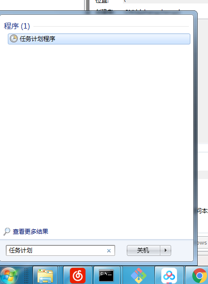
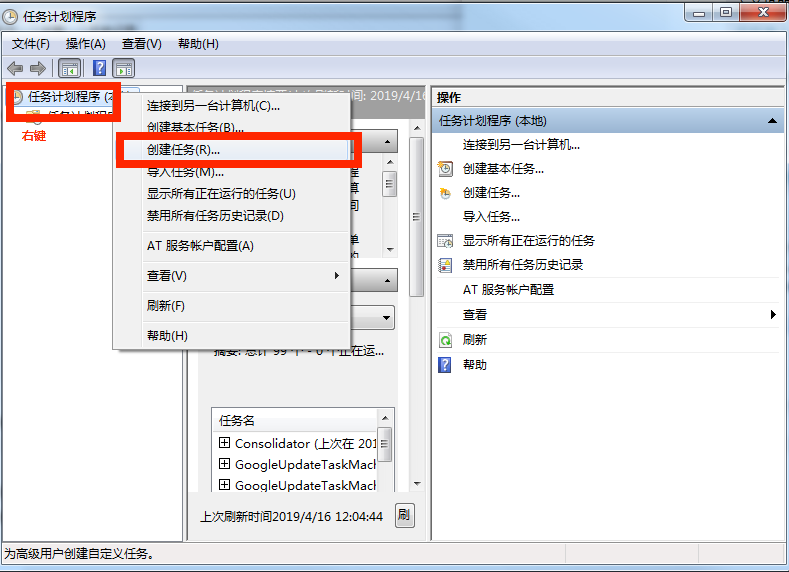
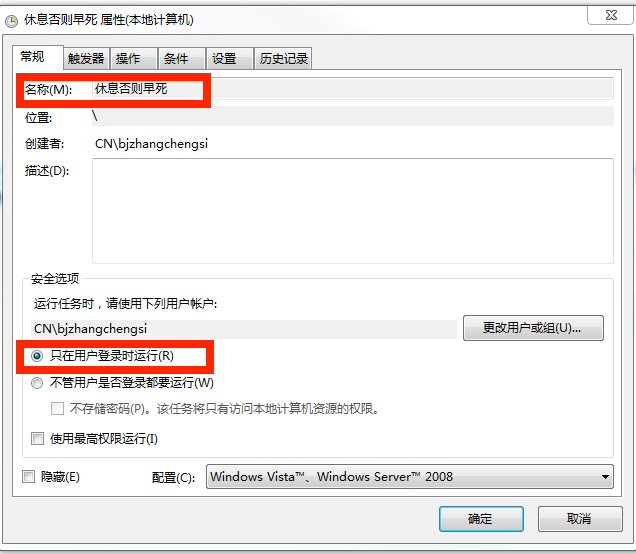
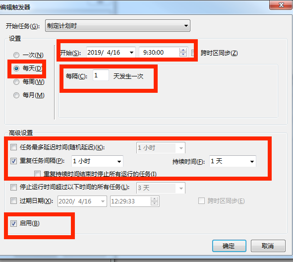
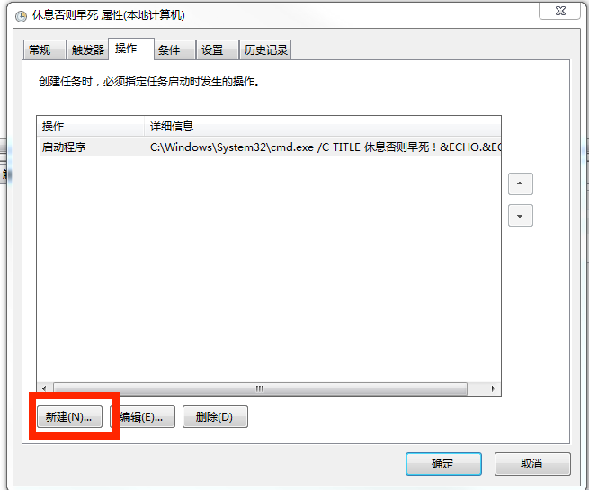

# 为了多活几年，强制提醒一小时休息一次

## 1. 开始菜单查找任务计划程序

## 2. 创建任务

## 3. 常规设置

## 4. 触发器设置

## 5. 操作设置

把下面的一行考到`添加参数`里

      /C TITLE 休息否则早死！&ECHO.&ECHO.       休息否则早死！多活几年吧！&ECHO       上厕所！喝水！走走！&TIMEOUT 120

