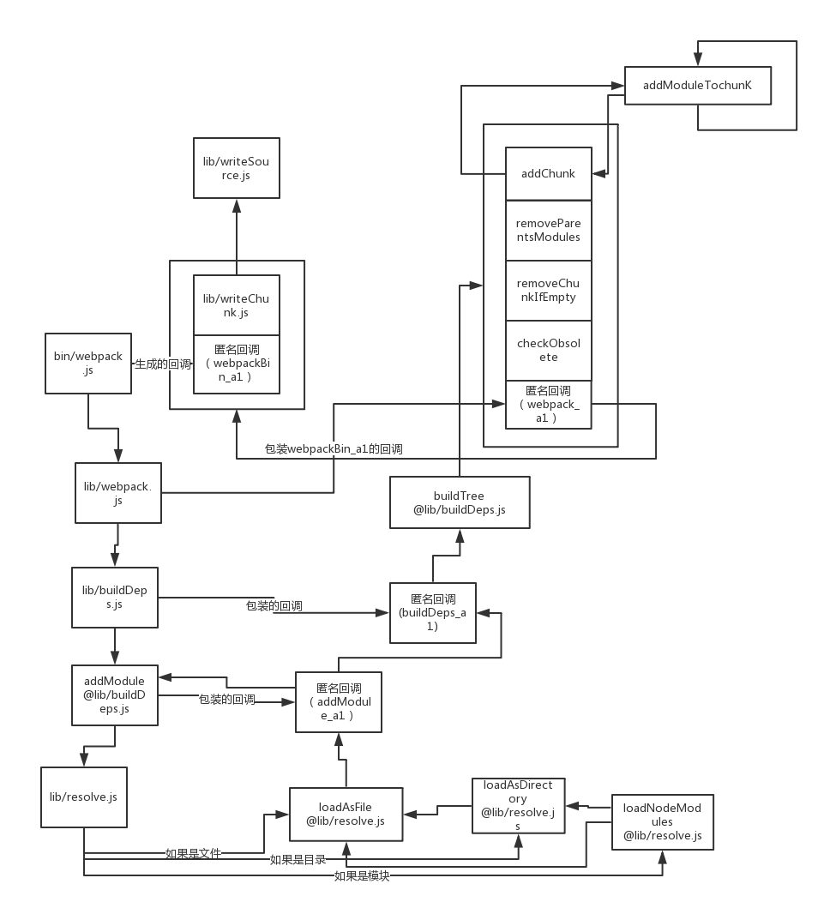

# webpack源代码解读(一)
## 起因
webpack是一个非常好用的工具，webpack的广泛使用正是前端工程化普及的最好证明，为了更好的使用webpack并了解其内部构造，决定读一读源代码。

## 介绍
文章按照自己分析的实际过程撰写。

## 选择源代码
1. git clone下github上源代码。
2. git log查看版本信息。
3. git checkout到最原始的版本。

## 寻找源代码入口
根据自身的经验，步骤一般是
1. 首先阅读readme文件
2. 查看package.json中的bin和main字段，（启动脚本和入口文件）
3. 浏览整个目录结构

那么根据查看readme，可以看到Usage用法是执行webpack，对应package.json中的bin，我们知道webpack对应于node bin/webpack.js，然后查看webpack.js文件，可以看到调用了lib/webpack.js中的方法。

然后再看，可以看到目录结构中有一个example，打开一看，有build.js,example.js两个文件，打开build.js文件，我们可以看到是一个实例文件，这就是我们需要的。

## debug build/build.js
在build.js中，使用node开了一个子进程调试，这样debug不到，
为了debug build.js我需要在vscode中添加debug配置如下：

    {
        "type": "node",
        "request": "launch",
        "name": "debugWebpack",
        "program": "${workspaceFolder}/bin/webpack.js",
        "console": "integratedTerminal",
        "cwd": "${workspaceFolder}",
        "args": [
            "${workspaceFolder}/example/example.js",
            "${workspaceFolder}/output/output.js"
        ]
    }

然后开始读代码

# 阅读的方式

  要阅读一个东西，最好是对他有一定的了解，最起码是用过，要不直接读代码会和看天书一样。

1. 由简到繁
直接在github上找到最原始版本开始读，读懂一个版本后，再通过git比较循序渐进的读后提交的版本。

2. 由点连成线
 一开始都是从入口函数开始读，然后大略看一下，然后看调用了哪些函数。将这些一个个函数连接起来，画成简单的程序调用图

3. 有粗到细
  当有了程序调用图后，我们就对整个代码有了一个总体的认识，然后依次解读每个函数。

4. 要有所思考
  当读到一些看不懂或精妙的地方，我们要反复研究为什么要这么做，要什么好处，把这个模式记录下来，争取用到以后当中。
  比如，在这个程序中，通过不停的把上一级传递到的回调进行包装并传给子函数的方式，实际上就是一种代理模式，精简了代码。

# 程序调用图

# 基本概念
## module： 模块，一个模块就是一个文件
## chunk：代码段，一个chunk就是一个入口文件所依赖到的所有模块的集合。
## deptree:一个依赖树，主要的操作就是生成这个树。
	var depTree = {
        //包含所有的模块，键是文件绝对路径
		modules: {
            absolutePath: {
                //id是唯一的模块id，数字，从0开始,新模块加1
                id: depTree.nextModuleId++,
                //filename是文件绝对路径
                filename: filename,
                //requires是本文件引用的所有同步依赖
                requires: [        
                    {
                        //代码在第几列
                        column:8
                        //代码在第几行
                        line:1
                        //引用名字是什么
                        name:"a"
                        //依赖的名称在整个代码中的开始和结束位置
                        nameRange:Array(2) [16, 18】,
                        //模块id
                        id: 
                    },
                    {
                        column:8
                        line:2
                        name:"b"
                        nameRange:Array(2) [39, 41]，
                        //模块id
                        id: 
                    }
                ],
                //async是本文件引用的所有异步依赖
                async: [
                    {
                        column:0,
                        line:3,
                        namesRange:Array(2) [61, 65],
                        requires: [
                            {
                                name: "c",
                                id:
                            },
                            {
                                column:11,
                                line: 4,
                                name: "b", 
                                nameRange: [101, 103] 
                            },
                            {
                                column:12,
                                line: 5,
                                name: "d", 
                                nameRange: [134, 136] 
                            }
                        ]
                    }
                ],
                //文件源代码
                source: ""
            }
        },
        //包含所有模块，键是模块id，值和上边一样，是一个速查的对象
		modulesById: {},
		chunks: {},
		nextModuleId: 0,
		nextChunkId: 0,
		chunkModules: {} // used by checkObsolete
	}
# 具体函数分析
## buildDeps
最核心的函数，创建依赖树。构建依赖树的模块，然后构建依赖树的代码段。然后对代码段做去空，去重等处理。

## addModule
调用resolve方法寻找文件位置，然后在回调addModule_a1中添加模块信息。

## resolve
  解析文件，仿照commonJs规范，
  首先判断是模块还是非模块（根据有无地址），如果不是模块，首先按照同名文件找，然后按照文件名加后缀（默认"js", "web.js"）找，如果没找到，
  按照文件夹找，如果package.json存在，寻找main字段的文件，否则寻找目录下index文件。

## addModule_a1
定义模块相关的依赖树信息：
//modules中的键是文件绝对路径，
//id是唯一的模块id，数字，从0开始,新模块加1
//filename是文件绝对路径
//source是文件源代码
//require是本文件引用的所有同步依赖
//async是本文件引用的所有异步依赖
var module = depTree.modules[filename] = {
    id: depTree.nextModuleId++,
    filename: filename,
    requires: [],
    async: [],
    source: ""
};

首先读取文件内容，然后调用parse进行词法分析。parse的部分没有细看，有兴趣的同学可以仔细研究下
解析出来所有的依赖信息，
结构如下：
{
    //解析的文件中所有同步的依赖
    requires: [
        {
            //代码在第几列
            column:8
            //代码在第几行
            line:1
            //引用名字是什么
            name:"a"
            //依赖的名称在整个代码中的开始和结束位置
            nameRange:Array(2) [16, 18】
        },
        {
            column:8
            line:2
            name:"b"
            nameRange:Array(2) [39, 41]
        }
    ],
    //解析的文件中所有异步（通过jsonP技术动态引入的部分，代码中对应require.ensure的部分)
    asyncs: [
        {
            column:0,
            line:3,
            namesRange:Array(2) [61, 65],
            requires: [
                {
                    name: "c",
                },
                {
                    column:11,
                    line: 4,
                    name: "b", 
                    nameRange: [101, 103] 
                },
                {
                    column:12,
                    line: 5,
                    name: "d", 
                    nameRange: [134, 136] 
                }
            ]
        }
    ]
}
asyncs中有可能嵌套asyncs和requires，递归检索出这个文件中依赖的所有文件，如果依赖的文件为0，直接执行回调。
否则对每个依赖文件调用addModule方法，在回调里判断剩余处理模块是不是0，如果是0或报错，调用回调。
否则回调里就设置对应模块的id。

bin/webpack.js - 提取参数，传递结束的回调函数一直到底层（有错误输出错误，没错误输出stats信息）。调用lib/webpack.js
    -lib/webpack.js 
       包装回调callback参数给buildDeps
        -lib/buildDeps 
            创建depTree核心对象，保存读取的模块

                var module = depTree.modules[filename] = {
                    id: depTree.nextModuleId++,
                    filename: filename
                };
            	var depTree = {
                    //键是filename，值是module对象
                    modules: {},
                    //键是modulesId，值是module对象，同上，只不过是根据moduleId查找
                    modulesById: {},
                    chunks: {},
                    nextModuleId: 0,
                    nextChunkId: 0,
                    chunkModules: {} // used by checkObsolete
            }
            包装回调callback参数，给addModule
            -lib/addModule 封装传进来的回调: 有错误处理错误，处理结束后调用buildTree。
                包装回调callback参数，给resolve 
                回调：判断文件名是否已经处理过，如果处理过，直接取出depTree.modules[filename]。
                否则放到depTree.modules中，
                var module = depTree.modules[filename] = {
                    id: depTree.nextModuleId++,
                    filename: filename
                };
                执行fs.readFile获得文件内容，然后执行
                    -lib/parse.js解析源文件，调用esprima库的parse，然后分析语法树，最后弄出一个对象，
                    包含requires数组和asyncs数组。

                -lib/addModule中给resolve的回调：
                    如果失败，调用上级回调
                    如果depTree.modules中有文件名的缓存，直接把缓存的moduleid作为参数调用上级回调
                    如果没缓存，首先读文件，然后调用parse方法
                    parse出一个对象，里面包含require和async属性，每个属性是一个数组，包含这个文件中所有同步依赖和所有异步依赖的文件。
                    然后遍历parse出的对象中的requie和async中所有的依赖，把唯一的依赖放到
                    requires对象中。然后对每个依赖的文件递归调用addModule，生成每个模块id，模块id就是每个文件的id。

                buildTree
                    调用addChunk往deptree中放入chunk信息。
                    chunk的概念就是以一个module为入口的所有module的集合。
                    如果一个模块中有动态引入的module的话，如果这个module没有chunkid，执行addCHunk，    
                    如果这个引入的模块有chunkid，就把这个chunk的parents中添加这个模块（有动态引入的模块）本来的chunkid。
                    -removeParentsModules
                    -removeChunkIfEmpty
                    -checkObsolete

                addChunk
                    设置chunkid，modules（包含哪些模块），context（入口模块）
                    把入口模块的chunkid设置成这个chunkid
                    -addModuleToChunk
                addModuleToChunk
                    第一把入口模块的chunks中push所属的chunksId、
                    第二把所属的chunks.module中放入moduleid
                    第三遍历require和async的文件，执行addModuleToChunk

                removeParentsModules
                    把有parent属性的chunks（异步调用chunk）中的module在所有父亲chunk中遍历一遍，看是否模块在父亲中存在，
                    如果存在打上标记:"in-parent"

                removeChunkIfEmpty
                    遍历chunks的module，如果没有include的文件，就去掉这个chunk

                checkObsolete
                    查看是否有重复的chunks（chunks下面的modules都一样），如果有，去掉

                -lib/resolve 
                    如果是相对，绝对路径，调用loadAsFile，回调函数是如果失败，那么执行loadAsDirectory
                    否则判断是node模块，调用loadNodeModules
                -loadAsFile
                    调用node的fs.stat，先尝试读取filename,如果失败，会读取extens数组的后缀，默认是.js,.web.js文件，如果后缀列表都失败，调用失败回调，会使用loadAsDirectory尝试调用文件夹。（这里的技巧就是在回调函数中再次调用方法，有的时候，回调的链式调用是必须的，比如propmise中，需要记住上一个promise的函数等，但大多数时候，是增加维护的复杂度）
                -loadAsDirectory
                读取目录里的package.json文件中的main字段，如果存在main字段，那么调用laodAsFile，fileName是main字段，如果不存在main字段，默认是index
                    

                    数据结构：
                    
                    {
                        key名是文件绝对路径,每个对象代表一个文件
                        modules: {
                            //动态引入的模块里面有由parse封装的位置信息
                            asyncs: [{
                                chunkId: 1,
                                chunks: [],

                            }],
                            //chunk的id，这个chunkId表示由一个入口文件所引用的所有文件的集合，
                            // 一个文件中动态引入的不算一个chunkId
                            chunkId: 0,
                            //代表这个模块属于哪些chunksId
                            chunks: [0],
                            filename: "e:\test\webpack\example\example.js",
                            //这个是模块id，和chunkId分开
                            id: 0,
                            //同步引用的模块，里面有由parse封装的位置信息
                            requires: [

                            ],
                            source: "var a = require('a');\r\nvar b"
                        },
                        //用来表示chunks，也就是由一个模块入口构成的集合
                        chunks: [{
                            //代表入口的模块
                            context: {

                            },
                            //chunkId
                            id: 0 ,
                            //key是模块id，代表这个chunk包含哪些模块
                            modules: {
                                0: "include,
                                1: "include,
                                3: "include,
                            }
                        }],
                        //里头全是id，和modules一样，只不过key是moduleId
                        modulesById: {

                        }
                    }

# 相关资源

项目地址：https://github.com/zcs19871221/webpack-1/tree/read 我fork的webpack原始版本。增加了一些注释
程序调用图：

  