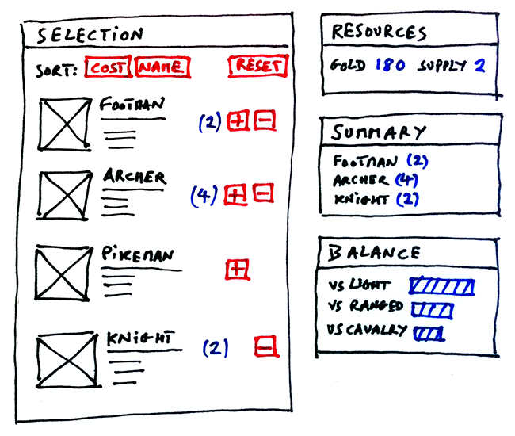
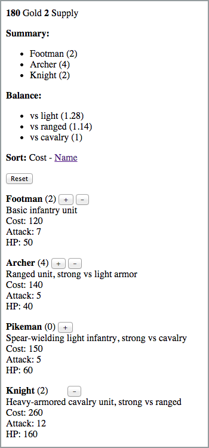

# 使用数据描述 UI 状态 [原地址](http://nicolashery.com/describing-ui-state-with-data/)

TLDR;

1. UI 就是数据，展示是数据，用户交互是数据转换。
2. 在开发前，花费多一些时间考虑如何从界面抽象出数据模型。
3. 开发步骤：
    1. 画出草图，分离出用例。
        1. 能做的操作
        2. 能看到的界面
    2. app状态建模成数据
        1. 只储存最小化的核心状态，不储存衍生状态
        2. 状态数据必须覆盖1.能看到的界面2.能做的操作的所有用例。
    3. 编写控制台版本app。
        1. 使用持久化工具 immutable.js。
        2. 创建初始状态。
        3. 编写 actions(在本文中是redux中的action和reducer的集合体) - 满足用户能操作什么。
        4. 编写 projections(对应redux的selector)-用来生成衍生状态和视图业务数据 - 满足用户能看到什么。
        5. 写actions和Projections(reducer和selector)的单元测试。
    4. 使用一个渲染库来根据状态渲染(react),给状态对象添加监听，改变后从新渲染(react-redux)
    5. 写图形界面（写渲染组件）
        1. 一开始只写html
        2. 展示：组件只是state到dom的映射 交互：通过绑定dom事件到actions实现。
        3. 所有的业务逻辑放到actions和projections中实现。
        4. 组件脱离逻辑，优点是更易复用，而且逻辑都在actions或projections，更易测试。

在这篇文章里我们遵循数据优先的方法构建了一个示例 UI。用户看到的只是 app 状态即一段数据的表示。当用户和界面交互的时候，用户只是在对数据进行转换。

当你写的时候，大多数的软件系统核心功能仅仅是对数据进行转换。考虑一个输入`A`，程序`P`产生一个输出`B`。在 Unix 命令行工具上常见这种模式，但是你也可以将这种模式用在更大的系统上，那么为什么不是一个用户界面呢？

当在查看 UI 界面的模型，以及一些用户用例时候（比如，用户点击这里，发生了什么），想象一下该界面的 JSON 数据（或者其他数据结构）应该如何表示？对 JSON 数据的哪些转换会覆盖这些用户用例？

在前端 web 应用程序的领域，新的开发库和设计模式鼓励大家按照上面说的方式思考（比如：`React,Flux,Om,DataSCript`)。甚至以前的`MVC`架构也把数据放到了第一位置，也就是 M"Model"层。把 UI 界面抽象成数据模型是重要的一步，并且在正式编程前你值得花费更多的时间来仔细思考。

声明：我没有想要在这篇文章中发明一些新东西。核心概念已经存在了，围绕这个思想的库和框架已经存在了。我想要做的仅仅是通过构建一个小例子，来关注这个核心概念而不是某个具体的框架或库，并且希望在这个过程中展示一些有趣的东西和这个方法的优点。这个例子很简单，因此一些东西没准看上去琐碎或者过度设计了，但是设计思路可以应用于大型 app 并且可以让你更容易维护和开发。

## 画出界面和用户交互的草图

当构建一个 app，解决实际问题和提供一个好的用户体验是最重要的。用户不关心我们的数据模型多么优雅。因此退一步，从纸上开始，画出 app 应该长什么样并且应该覆盖什么用户用例是一个好主意。

app 的用例是什么？让我们把他们分成两个组。第一组覆盖用户**可以执行的操作**：

- 当我点击’+’按钮，增加一个单位该类型兵种到我的军队中。
- 当我点击’-’按钮，从我的军队中移除一个单位该类型兵种。
- 当我点击’reset’按钮，从我的军队移除所有单位。
- 当我点击 Sort 后面的 cost, name 按钮，会按照花费或者名称排序这个所有可选择兵种的列表。

第二组描述了用户**可以看到的内容**:

- 我可以看到一个可用的排好序的单位列表，如果我能添加的话，每一个单位有一个’+’按钮可以看见。如果我们删除的话，每一个单位有一个’-;按钮可见。
- 我可以看到我剩余的资源。
- 我可以看到目前为止我的军队的排序后的概述列表。
- 我可以看到一个 balance 图表来帮助我在不同兵种间评估我的军队实力。

现在既然我们已经画出了可见内容和用例的草图，我们可以开始编码了。完整代码在[Github](https://github.com/nicolashery/example-ui-as-data)

## 将 app 状态建模成数据

画出草图后，这个可能是最重要（也是最有趣）的部分了，因此值得花费一些时间思考（我们的例子很小，大型 app 需要更多的思考时间）。值得注意的是，有不同的方式来模拟事物，没有对错。无论我们使用什么方式建模，我们都要遵循下面的原则：

- 我们识别并区分出’核心状态’和’衍生状态’。我们只储存核心状态在我们的 App 状态对象中，并且我们保持核心状态尽可能小。（比如，如果我能通过某种方式从计算出某个状态，那么我们不保存他)

在我们的例子中看上去应该如何？

- 我们需要用户在当前阶段可用的包含单位属性的单位列表（没准从存储用户进程的后台获取）
- 我们需要用户在当前阶段可用的资源（从后端获取）
- 每一个兵种，我们需要一个计数器（初始化为 0）每次用户点击增加时候+1。
- 我们需要一个状态跟踪排序属性。

一个 JavaScript 对象来描述状态是这样：

    {
        resources: {gold: 1500, supply: 10},
        sort: ’cost’,
        units: {
            archer: {
                count: 0,
                name: ’Archer’,
                description: ’Ranged unit, strong vs light armor’,
                cost: 140,
                attack: 5,
                hp: 40,
                bonus: {light: 4}
            },
            // ...
        }
    }

这个数据只保存核心状态，比如`resources`属性只保存**开始资源**，我们不保存**剩余资源**。因为剩余资源可以根据起始资源和选择的兵种数量计算出，是衍生状态：

    f(starting resources, count of each unit) -> remaining resources
    f(core state) -> derived state

对于已排序的单位选择列表，已排序的军队摘要以及军队平衡图后面的数据也是如此。我们称之为“投影”，我们稍后会看到更多关于它们的信息。

通过合适的"Projections"，我们验证了这个状态模型可以覆盖第二组用户用例（用户能看到什么）。那么第一组呢（用户能操作什么）？

- 增加/移除一个单元改变`count`属性
- 点击"Reset"改变每个单元的`count`属性值为 0
- 点击"Sort"按钮改变`sort`属性。

我们的应用程序状态数据模型似乎有效，因此我们可以继续下一步。

## 编写应用程序的控制台版本

让我们创建一些函数来转换之前定义的状态对象。

我们将要使用库[immutable](https://github.com/facebook/immutable-js)中的数据结构。
两个主要原因是：

- 从核心状态投影到衍生状态通常涉及数据操作。我们可以使用 immutable 持久化数据结构来防止侵入式复制对象，这样让我们将精力集中在其他的事情上。
- 这个库有一些有用的方法来帮助我们操作数据结构。

即使你从没用过 immutable，你也可以很快上手，因为他的 api 非常直接。

我们将要创建一个`State.inital()`函数来返回初始状态：

    State.initial = function() {
        return Immutable.fromJS({
            resources: {gold: 1500, supply: 10},
            sort: ’cost’,
            units: {
                footman: {
                    count: 0,
                    // ...
                },
                archer: {
                    count: 0,
                    // ...
                },
                // ...
            }
        });
    };

现在我们要创建`Actions`来覆盖用户同 app 交互的用例。一个 action 就是一个函数，接收当前状态并返回新状态：
(译者注：这里的 action 应该等同于 redux 的 reducer)

    action(current state) -> new state

举个例子，我们实现`Action.select(state, unit)`,这个函数当用户点击’+’时调用:

    Actions.select = function(state, unit) {
        return state.updateIn([’units’, unit, ’count’], 0, function(count) {
            return count + 1;
        });
    };

我们可以立刻在控制台测试：

    var s = State.initial();
    s.getIn([’units’, ’archer’, ’count’]); //-> 0
    s = Actions.select(s, ’archer’);
    s.getIn([’units’, ’archer’, ’count’]); //-> 1

你可以在[Action.js](https://github.com/nicolashery/example-ui-as-data/blob/master/src/game/logic/Actions.js)中找到所有实现的 action。

下一步，我们要创建**Projections**来把核心状态塑造成可以在组件中渲染的形式。一个投影就是一个函数来获取 app 状态并返回衍生状态或者视图:

    projection(state) -> view

举个例子，让我们实现`Projections.resourcesRemaining(state)`:填充剩余资源的组件 ui

    Projections.resourcesRemaining = function(state) {
        var goldInitial = state.getIn([’resources’, ’gold’]);
        var goldSpent = state.get(’units’).reduce(function(result, unit) {
            return result + unit.get(’count’) * unit.get(’cost’);
        }, 0);
        var goldRemaining = goldInitial - goldSpent;
        // Similar logic for `supplyRemaining` not shown here...
        return Immutable.fromJS([
            {id: ’gold’, name: ’Gold’, quantity: goldRemaining},
            {id: ’supply’, name: ’Supply’, quantity: supplyRemaining}
        ]);
    };

我们可以在控制台立刻测试:

    var s = State.initial();
    Projections.resourcesRemaining(s).toJS();
    // [
    //   {id: ’gold’, name: ’Gold’, quantity: 1500},
    //   {id: ’supply’, name: ’Supply’, quantity: 10}
    // ]
    s = Actions.select(s, ’archer’);
    s = Actions.select(s, ’footman’);
    Projections.resourcesRemaining(s).toJS();
    // [
    //   {id: ’gold’, name: ’Gold’, quantity: 1240},
    //   {id: ’supply’, name: ’Supply’, quantity: 8}
    // ]

你可以在[Projections.js](https://github.com/nicolashery/example-ui-as-data/blob/master/src/game/logic/Projections.js)发现剩余的投影方法。

通过`state` ` Actions``Projections `中的函数，我们已经创建了一个 app 的控制台版本。我们可以在控制台中测试。

我们也可以很容易的添加单元测试，因为这些都是纯函数:

- 对于一个动作，给定这个状态它是否会产生预期的新状态？
- 对于投影，给定此状态和这些参数，是否会产生预期的视图

        // test.js
        describe(’Actions.select’, function() {
            it(’increments count of selected unit’, function() {
                var state = Immutable.fromJS({
                    units: {archer: {count: 0}}
                });
                state = Actions.select(state, ’archer’);
                expect(state.getIn([’units’, ’archer’, ’count’])).to.equal(1);
            });

        });

        describe(’Projections.resourcesRemaining’, function() {
            it(’returns correct quantities of remaining resources’, function() {
                var state = Immutable.fromJS({
                    resources: {gold: 10, supply: 4},
                    units: {
                        footman: {cost: 1, count: 1},
                        archer: {cost: 3, count: 2}
                    }
                });
                var resourcesRemaining = Projections.resourcesRemaining(state);
                expect(resourcesRemaining.getIn([0, ’id’])).to.equal(’gold’);
                expect(resourcesRemaining.getIn([0, ’quantity’])).to.equal(3);
                expect(resourcesRemaining.getIn([1, ’id’])).to.equal(’supply’);
                expect(resourcesRemaining.getIn([1, ’quantity’])).to.equal(1);
            });

        });

更重要的是，我们甚至不需要浏览器或 DOM 来进行这些测试，它们可以在 Node 中的服务器上运行。

此时，我们已经实现了我们的应用程序的所有’业务逻辑’,而不用关心浏览器,HTML 和 CSS。

## 添加图形界面
我们终于可以开始在浏览器中呈现我们的应用状态及其预测，并将我们的操作与用户交互联系起来。我们将使用React，不仅因为它是一个受欢迎的选择，而且因为它非常适合模式“给定这个描述我的应用程序状态的数据，这就是DOM应该是什么样子”（即保持DOM与app状态同步）。但是，我们稍后会看到切换到另一个“渲染引擎”相当容易。

我们把我们的纯函数包装在一个状态化的`app`对象中。这只是一个实现技巧（纯函数是最重要的一点：他们保存着所有的业务逻辑，并且是我们要测试的对象）。这个对象的主要目标就是在app状态改变的时候触发一个从新渲染事件。（译者注：这里简单实现了react-redux)

    function render() {
        var gold = app.projections.resourcesRemaining()
            .getIn([0, 'quantity']);
        console.log('gold ' + gold);
    }
    app.addChangeListener(render);

    render();
    // console log: "gold 1500"
    app.actions.select('archer');
    // console log: "gold 1360"

我们的顶级react组件`App`将会监听状态的变化并且在变化的时候从新渲染：

    // App.jsx
    var App = React.createClass({
        componentDidMount: function() {
            app.addChangeListener(this.handleChange);
        },

        componentWillUnmount: function() {
            app.removeChangeListener(this.handleChange);
        },

        handleChange: function() {
            // Trigger a re-render
            this.forceUpdate();
        },

        render: function() {
            // ...
        }
    });

我们从一个‘HTML-only’版本开始。css会花费大量时间，我们希望尽快得到一个可以用的原型版本来让我们实际点击和测试。（我们甚至可以让设计师或其他开发人员来并行写css）

我们在界面上显示状态之前，先使用Projections把状态弄成我们需要的数据，这样我们可以保持我们的组件轻量和简单。所有的业务逻辑都包含在Projections的代码中。ui组件只是将其结果映射到dom元素。对于交互的实现，ui组件只需要通过绑定dom事件（mouse，keybord）到actions的映射就可以。

让我们实现`UnitList`组件：允许用户查看可用兵种并且可以添加到你的军队或从你的军队移除。组件只是渲染`Projections.unitList(state)`的结果：

    // Projections.js
    Projections.unitList = function(state) {
        // First, create a list from the `units` map
        var result = return state.get('units')
            .map(function(unit, key) {
                return unit.set('id', key);
            })
            .toList();

        // Next, sort by the appropriate attribute
        var sortAttribute = state.get('sort');
        result = result.sortBy(function(unit) {
            return unit.get(sortAttribute);
        });

        return result;
    };

    // UnitList.jsx (simplified)
    var UnitList = React.createClass({
        render: function() {
            return (
                

                    {app.projections.unitList().map(this.renderUnit).toArray()}
                

            );
        },

        renderUnit: function(unit) {
            return (
                

                    <strong>{unit.get('name')}</strong>
                    {' (' + unit.get('count') + ') '}
                    <button
                    onClick={app.actions.select.bind(null, unit.get('id'))}
                    style={{opacity: this.isSelectable(unit) ? 1 : 0}}>
                    {'+'}
                    </button>
                    {' '}
                    <button
                    onClick={app.actions.remove.bind(null, unit.get('id'))}
                    style={{opacity: this.isRemovable(unit) ? 1 : 0}}>
                    {'-'}
                    </button>
                

            );
        },

        isSelectable: function(unit) {
            var goldRemaining = app.projections
            .resourcesRemaining().getIn([0, 'quantity']);
            return goldRemaining >= unit.get('cost');
        },

        isRemovable: function(unit) {
            return unit.get('count') > 0;
        }
    });

这段代码看上去不错。但是你看到有需要改进的地方了吗？记住我们曾说的`所有的业务逻辑`应该包含在projections和actions，而不是ui组件中吗？我们的`UnitList`组件实际上仍然有一些重要的业务逻辑。我来演示一下：我运行代码，我开始添加一堆‘步兵’单位，当加到10个步兵的时候，‘+’按钮仍旧可见但是我的人口已经是0了。我忘了在`isSelectable(unit)`方法中添加人口的判断了。最好的方法是，我应该把‘isSelectable’和‘isRemovable’逻辑从我的组件中移出到projection方法中去，并针对这个bug增加一个测试：

    // Projections.js
    Projections.unitList = function(state) {
        // First, create a list from the `units` map
        // ...

        // Next, sort by the appropriate attribute
        // ...

        // Finally, add the selectable and removable flags
        var resourcesRemaining = this.resourcesRemaining(state);
        var goldRemaining = resourcesRemaining.getIn([0, 'quantity']);
        var supplyRemaining = resourcesRemaining.getIn([1, 'quantity']);
        result = result.map(function(unit) {
            return unit.merge({
                isSelectable: goldRemaining >= unit.get('cost') &&
                                supplyRemaining >= 1,
                isRemovable: unit.get('count') > 0
            });
        });

        return result;
    };
    // test.js
    describe('Projections.unitList', function() {
        it('sets isSelectable flag to false if not enough supply', function() {
            var state = Immutable.fromJS({
            resources: {gold: 10, supply: 0},
            units: {
                archer: {cost: 3, count: 2}
            }
            });

            var unitList = Projections.unitList(state);

            expect(unitList.getIn([0, 'isSelectable'])).to.be.false;
        });
    });
    // UnitList.jsx (simplified)
    var UnitList = React.createClass({
        render: function() {
            return (
                

                    {app.projections.unitList().map(this.renderUnit).toArray()}
                

            );
        },

        renderUnit: function(unit) {
            return (
                

                    <strong>{unit.get('name')}</strong>
                    {' (' + unit.get('count') + ') '}
                    <button
                    onClick={app.actions.select.bind(null, unit.get('id'))}
                    style={{opacity: unit.get('isSelectable') ? 1 : 0}}>
                    {'+'}
                    </button>
                    {' '}
                    <button
                    onClick={app.actions.remove.bind(null, unit.get('id'))}
                    style={{opacity: unit.get('isRemovable') ? 1 : 0}}>
                    {'-'}
                    </button>
                

            );
        }
    });

好多了！现在我的`UnitList`组件非常精简，只将数据从我的app状态投影映射到DOM。

相同的指南适用于其他组件。举个例子，我可以直接创建`ArmySummary`组件（针对具体业务逻辑的组件），在render方法里直接读取`unit`状态并渲染。但是如果我想要改变逻辑变成总是按照unitname排序或者unitcount？(译者注：作者的意思是这样他只能直接更改组件代码，或者写一个新组件针对新的业务逻辑)这样的话，创建一个projections`Projections.armySummary(state)`会更好，在这个方法里编写排序或者其他逻辑，复用组件代码。这样更容易测试，并且这样的组件更容易复用。

当我们完成其他组件时，我们已经拥有了一个功能齐全（尽管很难看）的应用程序。我们甚至可以开始将它提供给非常早期的采用者（可能是内部的），测试交互，将其连接到系统的其他部分（例如：后端）等。。

最后一步是添加CSS（原谅我糟糕的设计师技能），调整组件以输出具有正确类名的必要DOM元素。

你可以在[这里](http://nicolashery.github.io/example-ui-as-data)运行完整版本的app。

## 使用不同的渲染引擎
像我之前提到的，操作纯数据的函数包含了我们app的绝大多数业务逻辑，这种做法使我们和Dom/UI框架或库解耦（联系不很紧密）。我们可以转换react成一个别的‘渲染引擎’。

为了证明这个观点，让我们使用D3.js重构整个app的渲染部分。‘等等，什么？我认为D3.js是用来创建好看的svg表格的？’这话没错，但是d3.js处理纯html也很棒。实际上，d3实际上代表了‘data-driven documents数据驱动文档’，很适合我们的‘数据为中心’的方法。D3.js也和react非常不一样，这样重构也很有趣。但是‘给一个数据描述，dom结构就应该长什么样’的原则是相似的，此外它有他自己的一套优化从新渲染方法‘输入，更新，退出选择’（React使用‘虚拟dom’来优化）。当然，我不建议使用D3.js，我们只是证明这样设计能够把数据和dom解耦。

当有app状态变化的时候，我们将使用`render()`渲染。

    // engine.js
    var el;

    function create(element) {
        el = element;
        app.addChangeListener(render);
    }

    function destroy() {
        app.removeChangeListener(render);
    }

    function render() {
        var selection = d3.select(el);
        renderGame(selection);
        renderUnitList(selection.select('.js-UnitList'));
        // ...
    }

让我们看看UnitList前面看到的React组件的D3.js等价物：

    // unitList.js (simplified)
    function renderUnitList(selection) {
        var data = app.projections.unitList().toJS();

        // Data join
        var unit = selection.selectAll('.unit')
            .data(data, function(d) { return d.id; })
            .order();

        // Enter
        var enter = unit.enter().append('p').attr('class', 'unit');
        enter.append('strong').text(function(d) { return d.name; });
        enter.append('span').attr('class', 'count');
        enter.append('button')
            .attr('class', 'select')
            .text('+')
            .on('click', function(d) { app.actions.select(d.id); });
        enter.append('span').text(' ');
        enter.append('button')
            .attr('class', 'remove')
            .text('-')
            .on('click', function(d) { app.actions.remove(d.id); });

        // Enter + Update
        unit.select('.count')
            .text(function(d) { return '(' + d.count + ')'; });
        unit.select('.select')
            .style('opacity', function(d) { return d.isSelectable ? 1 : 0; });
        unit.select('.remove')
            .style('opacity', function(d) { return d.isRemovable ? 1 : 0; });

        // Exit
        unit.exit().remove();
    }

请注意，与React组件一样，此D3.js代码只是app.projections.unitList()数据到DOM元素和属性的映射，以及一些连接app.actions.select(unit)和app.actions.remove(unit)DOM事件的连接。渲染功能保持简单，不包含任何其他逻辑。

## 更多思考
以上是我们的例子。通过不使用任何框架或库（除了immutable）来构建处理状态逻辑的应用程序的“数据”部分，我希望将重点放在从数据方面思考UI的概念和过程。当然，对于“真正的”生产应用程序，我建议使用其中一种经过验证的模式和库。

Flux是其中一种模式，其方法非常相似。您将再次找到“actions”的概念，这些actions将导致状态更新。此状态在不同的“存储”中进行管理，由您来定义哪些存储包含“核心状态”并且包含“派生状态”（使用存储依赖关系，通过waitFor方法）。RefluxJS是一个有趣的Flux实现，略有不同：商店可以收听其他商店，因此它具有更明确的“核心状态与预测”主张。

当然，我们的例子非常简单，在真正的应用程序中需要考虑其他事项。例如，我们在哪里放置I / O（通过HTTP与服务器通信，更改浏览器URL，在浏览器的本地存储中保存数据等）？我们如何处理Web应用程序的异步性质（例如：从HTTP请求返回的响应）？我们有时可以执行一些验证以防止应用程序进入“糟糕状态”吗？也许我们需要在用户交互和更改应用程序状态的“操作”之间使用“命令”层，但这可能意味着为操作添加“队列”以确保每个命令处理程序都能看到最新状态在决定做什么之前。此外，我们每次渲染时都会重新计算“投影”，如果需要大量计算，这可能会很昂贵。也许我们需要将它们包装在某个有状态对象中，并且只有在它们使用的状态部分发生变化时才重新计算它们。
（译者注，基本就是redux的实现）