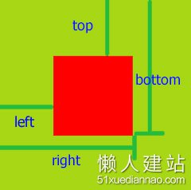
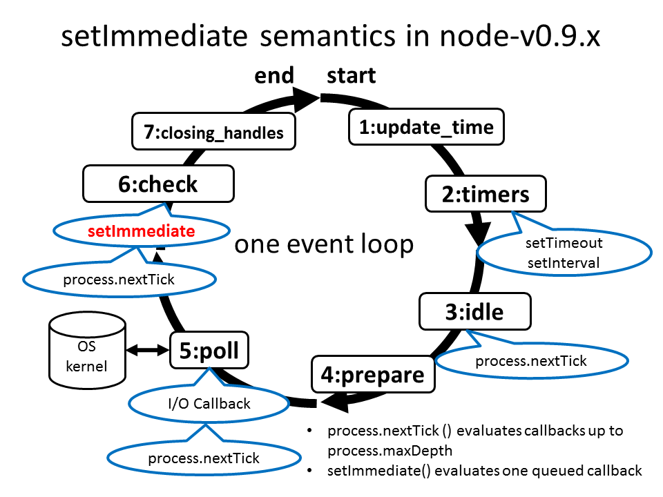
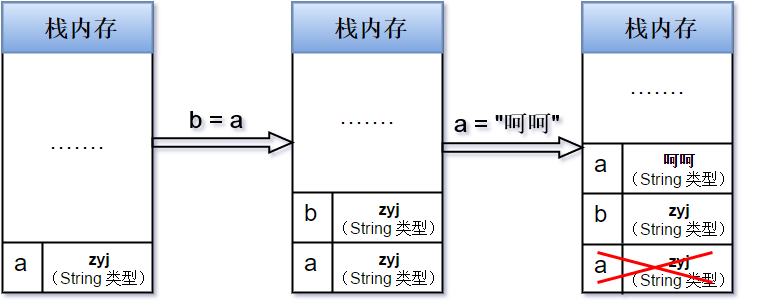
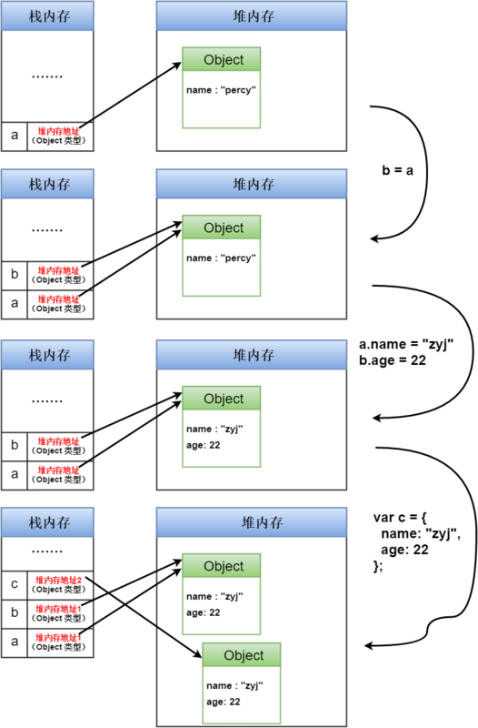

#html
[a标签设置点击事件如何设置href属性](#user-content-a标签设置点击事件如何设置href属性)

[关于tabindex和键盘事件](#user-content-关于tabindex和键盘事件)

[制作表头固定-左侧第一列固定-横向竖向可滚动](#user-content-制作表头固定-左侧第一列固定-横向竖向可滚动)

#js
[debounce的再次学习](#user-content-debounce的再次学习)

[关于正则正向肯定查找](#user-content-关于正则正向肯定查找)

[function构造函数的妙用](#user-content-function构造函数的妙用)

[关于正则的逻辑或](#user-content-关于正则的逻辑或)

[throttle](#user-content-throttle)

[关于js中的数字计算问题](#user-content-关于js中的数字计算问题)

[关于Number的toString方法](#user-content-关于number的tostring方法)

[关于textContent](#user-content-关于textcontent)

[关于bowlder中的defer](#user-content-关于bowlder中的defer)

[bowlder中load如果带at符号的处理](#user-content-bowlder中load如果带at符号的处理)

[正则exec和test使用全局标识匹配的问题](#user-content-正则exec和test使用全局标识匹配的问题)

[元素相对位置](#user-content-元素相对位置)

[关于图片加载完成的回调函数](#user-content-关于图片加载完成的回调函数)

[不能冒泡的js事件](#user-content-不能冒泡的js事件)

[动态加载html中含有style和script的处理](#user-content-动态加载html中含有style和script的处理)

[bowlder的数据绑定](#user-content-bowlder的数据绑定)

[mouseover和mouseenter区别](#user-content-mouseover和mouseenter区别)

[offsetWidth-clientWidth-scrollWidth](#user-content-offsetwidth-clientwidth-scrollwidth)

#node
[nodejshttp请求agent](#user-content-nodejshttp请求agent)

[node的读文件和pipe的内部原理](#user-content-node的读文件和pipe的内部原理)

# css
[等比例盒子](#user-content-等比例盒子)

[图片截取](#user-content-图片截取)

[css换行和超出部分隐藏](#user-content-css换行和超出部分隐藏)

[边框三角](#user-content-边框三角)

# http协议相关
[content-type](#user-content-content-type)

[关于http请求的请求体](#user-content-关于http请求的请求体)

[关于响应头Transfer-encoding](#user-content-关于响应头transfer-encoding)

# 其他
[chromedebug快捷键](#user-content-chromedebug快捷键)

[v8的设计架构](#user-content-v8的设计架构)

[NE的本地模拟环境流程](#user-content-ne的本地模拟环境流程)

[sublimtetext技巧](#user-content-sublimtetext技巧)

[javascript和java面向对象的区别](#user-content-javascript和java面向对象的区别)

#git
[git学习](#user-content-git学习)

[git技巧](#user-content-git技巧)

* * *

# a标签设置点击事件如何设置href属性
## 解释
  如果从想使用点击这个事件绑定到a标签这个事情来说的话,使用href="javascript:void(0),两个原因:

1.   如果使用#的话,必须在函数结尾加上return false或者preventDefault语法,
     防止默认的跳到页面开始位置.
2.   如果执行函数中抛出了错误,那么如果没有很好地错误处理的话,错误后面的
           代码就不会执行,那么就会跳到页面开始的位置.

  但是,更好的体验是:
  a标签的作用就是打开一个新的连接,所以如果你确实是想打开一个新的连接的话,
  直接使用href属性指向你的目标连接,而不要用onclick,
  因为onclick在使用滚轮点击和浏览器禁用javascript的情况下会无效.
  所以尽量不要在a标签中使用onclick,因为它还会导致侵入式的编程,并且不利于
  拓展和维护,因为在html中耦合了太多的代码.如果要要是用的话,直接写个button样式
  或者不给a标签增加href属性.

## 参考
[stackoverflow](http://stackoverflow.com/questions/134845/which-href-value-to-use-for-javascript-links-or-javascriptvoid0)

[非侵入式javascript](https://en.wikipedia.org/wiki/Unobtrusive_JavaScript)

[渐进增强](https://en.wikipedia.org/wiki/Progressive_enhancement)

# debounce的再次学习
  debounce用于防止短时间内重复执行函数太多次，目的是指定一个时间wait，
  让函数的真正执行至少在wait秒之后，期间如果连续触发函数，
  那么函数的真正执行在最后一次触发的wait秒之后。
  当第一次触发的时候，设置timeout到wait秒以后执行later函数。然后再触发的时候，只要timeout非空（没开始执行），只记录触发的时间，参数等,不再处理。
  later函数会判断现在时间减去最近一次触发debounce的时间，如果小于指定的延迟，那么再次延迟wait-last的时间执行。

# throttle
 触发函数后，每隔wait秒执行一次，如果中间多次触发，不响应。

# 关于tabindex和键盘事件
https://developer.mozilla.org/zh-CN/docs/Web/Accessibility/Keyboard-navigable_JavaScript_widgets

# 关于js中的数字计算问题
一定要注意，js的计算是有小数点的，没有整数，注意处理

# 关于正则正向肯定查找
    用于匹配zcs?=asd仅当zcs后面跟着asd才匹配

# function构造函数的妙用
    通过传参数可以把参数写入到函数体中，这样有些表达式可以不通过eval而是写成函数体。
    function genFunc(expr) {
        return new Function('obj', 'with(obj)return ' + expr);
    }
首先可以通过表达式的结果动态的创建函数，而且可以传参数。
## 构造函数和直接定义在作用域上的不同
  通过Function构造函数创建的函数,其作用域只有自己和全局两个,而不是像一般
  函数,作用域还包含了其定义的作用域.
## 参考
[MDN](https://developer.mozilla.org/en-US/docs/Web/JavaScript/Reference/Global_Objects/Function)

# 关于正则的逻辑或
    使用时候最好在需要或的地方加()，否则范围不定：
    /^abc|123$/ 对应实际是：
    
    /^ab(c|123)$/
    /^ab(c|12)3$/
    /^ab(c|1)23$/
    /^a(bc|1)23$/
    /^a(bc|12)3$/
    /^a(bc|123)$/
    /^(abc)|(1)23$/
    /^(abc)|(12)3$/
# content-type
 标识内容的mime-type
 请求头用来标识Post,put请求的formdata类型
 响应头用来标识返回内容的类型

# 关于http请求的请求体
[详见overstack回答](http://stackoverflow.com/questions/16339198/which-http-methods-require-a-body#answer-16339271)

关于crlf 等价于回车换行 \r\n

    一般来说，除了trace请求，
    head,1xx,204,304返回外，其他的都可以有请求体。
    
    an entity-body is explicitly forbidden in TRACE requests only, 
    all other request types are unrestricted 
    (section 9, and 9.8 specifically)
    
    a message-body is explicitly forbidden in responses to HEAD 
    requests (section 9, and 9.4 specifically)
    a message-body is explicitly forbidden in 1xx (informational), 
    204 (no content), and 304 (not modified) responses (section 4.3)

# 关于响应头Transfer-encoding
1. 常用于长连接，用来分片返回数据，告诉客户端什么时候传输结束。
2. 是pop-by-pop头
   [国内文章](https://imququ.com/post/transfer-encoding-header-in-http.html)
   [MDN](https://developer.mozilla.org/en-US/docs/Web/HTTP/Headers/Transfer-Encoding)

# 关于客户端如何判断响客户端发送结内容结束
1. 返回头content-length的值
2. 如果有Transfer-encoding头，值为chunked，忽略content-length
   的值，根据分片的长度判断，直到最后一片长度为0
3. 如果不是长连接，当服务端连接关闭时候。

详见[国内文章](https://imququ.com/post/transfer-encoding-header-in-http.html)

# 关于Number的toString方法
    Number.toString()是数字转换成字符串的方法，接受一个参数，用来表示转换的进制。默认是10。
    如果(35).toString(36) = z;

#关于textContent
node接口的一个属性,用于获取或设置这个dom的文本.
注意用法:
node.textContent = "";
当设置textContent值的时候,这个节点的所有childNodes都被移除,替换成一个包含字符串的文本节点,在jquery中用作

# 关于bowlder中的defer
[参见我的源代码阅读](%e6%ba%90%e4%bb%a3%e7%a0%81%e8%a7%a3%e8%af%bb%2fpromise%e8%a7%a3%e8%af%bb%e5%92%8c%e8%87%aa%e5%b7%b1%e7%9a%84%e7%ae%80%e5%8d%95%e5%ae%9e%e7%8e%b0.txt)

# bowlder中load如果带at符号的处理
  会把父亲组件的路径去掉文件,然后加上@后头路径

# 正则exec和test使用全局标识匹配的问题
同一个使用全局标识的正则连续匹配会出现不正确匹配:因为lastIndex每次匹配都会变化,设置为匹配的最终位置下次匹配从lastIndex位置开始

    var reg = /test/g;
    console.log(reg.test("这是1个test"));
    console.log(reg.lastIndex);
    console.log(reg.test("test不错啊啊啊"));

# chromedebug快捷键

    激活/解除断点效果: ctrl + F8
    下一个断点: F8
    跳到下一个调用栈: ctrl + ,
    返回上一个调用栈: ctrl + .
    在控制台中执行: Ctrl + Shift + E
    增加断点: ctrl + B
    debug多行: shift + enter

# canvas操作像素
    ImageData
    https://developer.mozilla.org/en-US/docs/Web/API/Canvas_API/Tutorial/Pixel_manipulation_with_canvas

#元素相对位置
## 视窗位置:浏览器可见位置,不包含滚动条.
## element.getBoundingClientRect 
    获取相对于视窗(就是浏览器左上角的位置),这个位置是动态计算的,包含这个元素内层的滚动,但是
    不包含整个浏览器的滚动条的位置,如果要计算相对于页面内容左上角的位置,需要加上
    window.pageYOffset和window.pageXOffset 
    https://developer.mozilla.org/en/docs/Web/API/Element/getBoundingClientRect

## offsetLeftandoffsetParent 
相对于offsetParent元素的偏移位置
offsetParent是一个指向最近的（closest，指包含层级上的最近）
包含该元素的定位元素。如果没有定位的元素，则 offsetParent 为最近的 table 元素对象或根元素（标准模式下为 html；quirks 模式下为 body）。
所以对于中间的元素来说,如果有滚动条的话,随着滚动,
元素的位置会上下,左右移动,因此还应该把所有父元素(除去body或window)的滚动条移动距离加上或减去.

    function getPos(e) {
        var left = 0,
            top = 0,
            scrollLeft = 0,
            scrollTop = 0,
            b = e.parentNode;
        while (e) {
          left = left + e.offsetLeft;
          top = top + e.offsetTop;
          e = e.offsetParent;
        }
        while (b && (b.nodeName.toLowerCase() !== "body")) {
          scrollLeft = scrollLeft + (b.scrollLeft||0);
          scrollTop = scrollTop + (b.scrollTop || 0);
          b = b.parentNode;
        }
        return {
          left: left - scrollLeft,
          top: top - scrollTop
        }
    }

# 关于图片加载完成的回调函数
 先看正确的例子:
 var img = new Image();
 img.onload = function() {
    img.onload = null;
    callback();
 }
 img.src = url;

几个点:
  1.回调函数中不要引用img,会造成低版本的IE无法回收内存(自己引用自己),
  所以执行的时候如果设置回调函数为null,
  一方面保证内存不会泄漏,
  第二方面防止GIF图重复触发onload事件
  2.为什么src要放到onload后头,因为如果有缓存的图片,
  刚设置src可能瞬间就要触发onload,这时候有的浏览器onload事件还没有设置,
  所以先设置onload
  3.不要使用complete属性
  4.无论是否有缓存,加载完成都会触发onload事件

# v8的设计架构
  https://github.com/v8/v8/wiki/Design%20Elements
  http://blog.pluskid.org/?p=186

js为什么慢?因为它是动态语言,每次访问一个对象的时候,都得动态的查找它的位置,
而像java或c,每一个对象的偏移位置都是确定的,
根据编译时候它们固定的类结构,因此一次查找就是一个取偏移值的过程,很快.
1.v8的目标就是内部实现隐藏的类,新建对象创建一个隐藏类,每个属性创建一个,
指定属性的偏移值.
2.v8的垃圾回收快:
  1.垃圾回收时候会暂停程序
  2.只暂停部分的内存空间
  3.每个对象都有指针

# 不能冒泡的js事件
    focus, blur, load, unload, change, reset, scroll, most of the DOM events (DOMFocusIn, DOMFocusOut, DOMNodeRemoved, etc), mouseenter, mouseleave, etc
submit在chrome中是可以冒泡的。不能冒泡的事件都可以capture（捕获）。 

# 动态加载html中含有style和script的处理
1. html中的`<style>`和`<link>`处理   
   把html中的`<style>和<link>`提取出来放到head中,等加载完成后,再把html append到页面上防止页面二次渲染(无样式闪烁)

  通过建个div,把innerHTML放到这个element中,然后取出`<style>`和`<link>`元素,
  创建标签，添加onload事件设置计数器,把这些元素放到head标签里,
  当这些link和style元素触发onload时候，
  通过类似promise的all的计数方法,判断是否都触发完毕，
  然后把innerHTML放到页面上.

2. html中的script标签

在有些浏览器中,直接innerHTML一个script是不能生效的,必须创建,append才行

    var a = createElement("script")
    a.src = "xx";
    document.body.appendChild(a);

# NE的本地模拟环境流程
后端三个环境:
1. 开发
2. 测试
3. 正式
   本地通过本地server转发请求到开发环境
   本地没问题push到测试环境进行测试
   没问题后放到正式环境
   部署流程:
   把放在后端svn上的代码通过Go系统做处理,合并,打包,替换ajax地址成本地文件后,
   放到前端svn地址,告诉后端,然后后端再从前端svn拉取代码,部署到线上.

4. 通过nodejs创建本地模拟后台,gooda
5. gooda可以配置不同域名和对应的目录位置,访问对应域名时候访问对应目录
6. 请求的html,css,js文件直接从本地目录读,返回
7. 如果html涉及到后端语言,就按照后端语言渲染了返回
8. 如果有ajax请求的话,后台会根据配置的路由进行选择,然后转发到真实的后台服务器
9. 给前端的后端地址都是一个IP，但是需要前端配置不同的hosts，
   后端会根据访问的hosts进行一个路由的转发。

# git学习
1.  和其他代码管理的区别
    1. cvs的问题:单点故障,影响所有客户端：服务器挂了,数据全丢了
    2. git是分布式的,每个节点保存所有的代码,服务器挂了,别的节点可以完全恢复。
    3. 分支管理特别简单
2.  git特点
    1. 保存的是每个版本文件的快照,而不是其他的差异列表
    2. 安全性高,每次修改,上传都做md5计算
3.  git配置
      中文文件名显示：

         #不对0x80以上的字符进行quote，解决git status/commit时中文文件名乱码
         git config --global core.quotepath false

# 制作表头固定-左侧第一列固定-横向竖向可滚动
 html结构是:
    

      <header style="overflow-x: hidden">
      </header>
      

        <firstColun style="position:absolute;left:scrollLeft">
      

    

  这样做出来,表头和内容实际是两个独立的滚动部分.然后让表头的横向滚动hidden,
  让内容垂直滚动.然后通过内容的滚动,触发scroll事件,让表头的scrollLeft和内容的scrollLeft同值,实现内容滚动,表头也滚动.然后再设置第一列的元素为绝对定位,横向滚动时候,让这些元素的left属性等于scrollLeft.

# git技巧
## gitignore
 文件 .gitignore 的格式规范如下：
[详见Gitbook回答](https://git-scm.com/book/zh/v2/Git-%E5%9F%BA%E7%A1%80-%E8%AE%B0%E5%BD%95%E6%AF%8F%E6%AC%A1%E6%9B%B4%E6%96%B0%E5%88%B0%E4%BB%93%E5%BA%93#忽略文件)

  1. 所有空行或者以 ＃ 开头的行都会被 Git 忽略。
  2. 可以使用标准的 glob 模式匹配。
  3. 匹配模式可以以（/）开头防止递归。
  4. 匹配模式可以以（/）结尾指定目录。
  5. 要忽略指定模式以外的文件或目录，可以在模式前加上惊叹号（!）取反。

如果要保存一个空目录的话，在目录下创建一个.gitkeep文件，然后
!tmp/.gitkeep

## 防止输入用户和密码
1. 给~/.gitconfig增加如下: 

    [credential]
        helper = store --file ~/.pwd
2. 编辑.pwd文件增加
      username=[]
      password=[]

### 我的gitconfig文件在同目录下

# 等比例盒子
核心方法就是利用padding-bottom的百分比是按照宽度的百分比来计算的，
这样设置宽度一定，高度为0，通过设置padding-bottom为宽度的对应比例。
    https://w3ctech.com/topic/1483

# 图片截取
1. 设置好父亲div的比例,按照比例,让image窄一点的边max-height100%,然后
   截取长的边(多出来的部分-长度)/2对应的margin,父亲divoverflow hidden
2. 设置背景图片,background-size: cover background-position: center

# bowlder的数据绑定
## 数据结构
 scope 
 widget 
 view 
 model
model是双向绑定
  通过向model的items里添加项目,形成数据<->视图的绑定.
  添加items时候,会绑定dom改变的事件函数,比如input元素对应change.
  改变dom会触发绑定事件的回调函数,触发model.update方法改变scope里的值

  改变scope值的时候(实际上是触发scope.refresh的时候)
  会遍历item里记录的items，每一个items找绑定的dom元素，获取dom的值，
  然后把这个值和scope里的值比较，如果不一样，就重新给node赋值。
view是单向绑定,只会当refresh时候,遍历views里的item,改变对应的dom

关于checkbox的双向绑定：
1. 当html遍历时候检测到ne-model指令时候，通过Models.prototype.add方法向Models数据类型中的items数组中添加一个包含node和scope的对象。
2. 然后给这个node绑定change事件 (如果是input或textarea,额外绑定input事件)，事件的触发函数是widget.update
3. 当元素改变值(触发change或input事件的时候)，执行widget.update，遍历models.item中的每一个双向绑定，执行【updateModel】改变scope的值，然后对每个子组件执行update方法。
4. updateModel方法
   1. 首先获得节点的value值，checkbox获取的是checked值。
   2. 调用getModel获得scope中绑定的变量的值
   3. 两者比较，如果不一致，那么执行saveModel保存node的value值到变量。
5. 关于model值刷新到node的方法refreshModel：
   1. 

#sublimtetext技巧
0. [快捷键常用](工具/sublime3快捷键.md)
1. 文件内搜索排除文件夹 

        -*/name_of_dir/*

# nodejshttp请求agent
目标是复用tcp链接,只有当设置了请求options的agent参数才可以

    new http.Agent({
      keepAlive: true,
      maxSockets: 1
    });
在node中,这个agent只有当sockets占满的情况下,才会对tcp池进行复用.
如果访问量小的话,maxSockets设置小一些,减少tcp创建,握手的时间,充分复用.
如果访问量大,maxSockets设置大一些,这样就不会因为访问量过大,导致少量的tcp链接被占用,然后等待tcp释放后再使用.
默认的maxSockets是无穷大，但实际上要根据操作系统的设置。

#node的读文件和pipe的内部原理
1. stream相关
   无论读或写流，都是通过内部函数_read或_write读或者写到一个缓冲区（buffer里），
   缓冲区的大小是highWaterMark参数控制。
   然后我们会从这个缓冲区里再读或者写到目标里。

2. pipe的实际作用
   我们从读缓冲区读出来，放到写缓冲区。
   如果写入速度慢，那么写缓冲区就会满，.write方法会返回false。
   然后我们就让读流暂停readstream.pause()，让写缓冲区释放。
   当写缓冲区释放到一定程度，会触发drain事件，
   在这个事件里再次让读流继续读radstream.resume()。达到控制的作用。
   pipe实际上帮我们平衡了读写，作用是减缓了内存的消耗，
   但是来回暂停的话实际是会拖慢速度的。

#http包头的格式
    HTTP1.1规定的HTTP包头格式如下
    请求方法 URI 协议/版本
    请求头：0或多行
    [\r\n\r\n] 两个CRLF(两个换行)
    正文部分
    --------------------
    协议/版本 状态码 状态描述
    响应头：0或多行
    \r\n
    正文部分

# css换行和超出部分隐藏
1. white-space 
   处理空白
2. word-wrap
   处理断句,不会在完整的词之间断句。
   如果一行放不下,首先会尝试放下一行看能不能放完整的,如果可以的话,
   就放到下一行.
3. word-break
   不考虑断句,直接有空白就断掉.
4. 超出字符串进行截取

      text-overflow: ellipsis;
      white-space: no-wrap;                
      overflow: hidden;

# mouseover和mouseenter区别
mouseover冒泡,在绑定元素内部的所有子元素的移动都会触发mouseover事件.
mouseenter不冒泡,绑定元素内部的移动不会触发该事件,只有进出绑定元素的时候
才会触发事件.

# offsetWidth-clientWidth-scrollWidth三种

1.  通过css或者style设置的width

     这个长度包含了滚动条的长度（如果有滚动条的话）

2.  cssWidth

       通过getComputedStyle获得的width属性，不包含滚动条的宽度和padding
       (在chrome下不包含滚动条长度)

3.  clientWidth

       包含padding的宽度，不包含滚动条宽度。

4.  offsetWidth：

       包括clientWidth + borderwidth + 滚动条宽度

5.  scrollWidth

       clientWidth + 滚动隐藏的内容长度

6.  算出滚动条宽度的方法有两种

       通用：
       e.offsetWidth - e.clientWidth - window.getComputedStyle(e).borderLeftWidth
    * window.getComputedStyle(e).borderRightWidth

    非chrome浏览器中计算出的width包含滚动条长度，所以：
    window.getComputedStyle(e).width + window.getComputedStyle(e).paddingLeft + window.getComputedStyle(e).paddingLeft - e.clientWidth

7.  注意事项

       clientWidth，offsetWidth 有可能因为浏览器缩放原因而不是整数，所以在计算的时候
       要注意小数js运算的问题
       另外getComputedStyle获取长款时候，获得的值有可能带PX，注意处理，通过
       parseInt(str, 10)能够直接截取后面非数字部分。

8.  判断一个元素是否有溢出或者隐藏的内容

       e.scrollWidth > e.clientWidth

# 边框三角
原理就是这张图

如果要实现不是实心的三角,使用另一个三角覆盖这个三角的一部分.

[参考](http://www.zhangxinxu.com/wordpress/2010/03/%E7%BA%AFcss%E5%AE%9E%E7%8E%B0%E5%90%84%E7%B1%BB%E6%B0%94%E7%90%83%E6%B3%A1%E6%B3%A1%E5%AF%B9%E8%AF%9D%E6%A1%86%E6%95%88%E6%9E%9C/)

# javascript和java面向对象的区别

javaascript的面向对象基于原型，而不是类

类继承：一个类就类似于一个蓝图-是对要创建对象的描述。
原型继承：一个原型就是一个工作对象实例。对象直接从对象获得继承。
传统的类继承有很多的缺陷，比如灵活性差，脆弱，最好使用对象组合而不是集成的方式，
而原型很适合对象组合。

原型继承的三种形式：
1. 连接继承

    直接复制对象属性到另一个对象，类似jquery的extend方法或es6的assign方法

2. 原型委托

    就是原型链继承，一直遍历prototype属性直到object.prototype，找到属性为止。

3.方法继承
    每个方法就是一个对象，如果这个方法不是构造函数的话，叫它工厂方法。通过工厂
方法直接生产出一个对象，给对象直接设置属性通过连接继承的方式。

作者的观念：
很多人认为js的继承就是原型链委托，但实际上原型链继承只不过是模拟java的类继承，而且还存在
类继承的问题，所以对js来说，最好的方式是使用对象组合。

## 原文地址
[类和原型继承的区别](https://medium.com/javascript-scene/master-the-javascript-interview-what-s-the-difference-between-class-prototypal-inheritance-e4cd0a7562e9#.wcbezftkc)

***
# node对比nextStick和setImmediate和setTimeout
nextStick在当前程序运行结束，进入到下个事件循环之前就执行，是最优先执行的，但是
这个类似于同步的操作，要注意造成阻塞，因为他会在任何事件循环里的io回调执行之前就进行操作。而且所有的nextStick方法都会一次性执行，比如在nextStick里一直nextStick方法的话，就会一直执行nextStick直到达到数量上限

setTimeout会在时间循环的时候检查timer，然后决定执行，如果只是为了延迟执行的话，
使用setImmediate，省去了检查时间的话费。

setImmediate会在下一个事件循环的末尾执行，每次事件循环只取出一个方法。
如果setImmediate和setTimeout都在一个io回调里出现，那么肯定是setImmediate先执行，因为setImmediate的循环在iocallback的后边。

>特别注意process.nextTick在Node.js v0.10后从事件循环中移除了。

[中文参考](https://cnodejs.org/topic/5556efce7cabb7b45ee6bcac)

[node官方参考](https://github.com/nodejs/node/blob/master/doc/topics/event-loop-timers-and-nexttick.md)

[node官方参考的翻译](http://www.codeba.cc/node-js-%E4%BA%8B%E4%BB%B6%E5%BE%AA%E7%8E%AF.html)

# 用户体验和网页响应速度
1. 每帧动画10ms产生一次。
2. 用户响应在100ms以内。
3. 载入或者视图切换在100-300ms以内是最好，其次可以接受的是300-1000ms。
4. 最大化空闲时间(用户没在交互，但主线程必须有空闲来迅速响应交互)
      1. 预加载尽量少，保证app迅速载入，剩下的预加载数据在空闲时加载
      2. 延迟的工作打包成50ms的块，每50ms把主程序控制权交换，保证100ms的响应原则。
5. 载入站点在1s以内。

# node命令行
1. `node --inspect`显示控制台
2. `node --expose-gc`可以在代码中调用`global.gc()`

# 内存检测
0. node有用的方法
   `process.memoryUsage().heapUsed`获取进程运行时占用内存
   `global.gc()` 手动触发垃圾回收操作

1. chrome任务管理器

   1. 打开方式 右侧竖着点点点->更多工具->任务管理器 或者Shift + Esc
   2. 列含义
      1. 最左侧的表示node内存
      2. 最右侧是js内存，括号里表示的是正在使用可获取的内存，如果这个值增大，说明新对象增加或现存对象变大。

# nodejs有关tcp，并发和requstAgent
### TCPKeepalive原理
[TCPKeepalive](http://tldp.org/HOWTO/TCP-Keepalive-HOWTO/overview.html)
## http_Agent
0. 如果不使用自己的agent的话，默认使用global.agent，三个值都是默认值，`keepalive=false, maxSockets=Infinity, maxFreeSockets = 256`因为maxSockets默认是无限大（实际上跟操作系统的参数一致），所以跟没有连接池差不多。
1. 如果确实不想用连接池的话，请设置`options.agent = flase`,禁止使用全局的连接池。
1. 发请求的http.agent的maxSocket指的是最多创建多少tcp连接，默认无限大。
2. keepalive选项开的话，实际调用的是socke.setKeepAlive。实际的作用就是激活操作系统的tcp协议的keepalive功能，在keepAliveMsecs时间之后会由系统发送keepalive嗅探包，具体的间隔根据操作系统定义。后续的操作都交给操作系统了。注意keepalive选项只是是否开启TCP keepalive功能，和连接池没关系，只要new了一个agent就会使用连接池。
3. 如果当前连接数目没超过maxSocket，
   而且有处于空闲状态的连接，就会复用空闲连接。
3. 每次发请求注意使用同一个agent，不能每次request的时候都new Agent，这样达不到
   复用tcp连接
4. 如果没有设置agent，默认使用global.agent，默认不开keepAlive
5. 注意maxFreeSockets选项，如果当前闲置连接数量大于maxFreeSockets，就会关闭多余空闲的连接。这时如果有新的请求过来，连接数没超过上限，又没有空闲的连接，就会再次创建一个新连接。
6. keepAliveMsecs:这个参数实际会作用于socket.setKeepAlive,并不是文档里写的每隔多少时间发送一个嗅探包判断对面是否还保持连接，而是tcp连接由空闲（最后收到数据的时间）开始计时，多少时间后第一次发嗅探包。相当于Linux参数TCP_KEEPIDLE。不过在最新版本的文档v7.7.1上已经改正了。[github上的讨论](https://github.com/nodejs/node/pull/10702)实际上这个值相当于Linux上tcp_keepalive_time。[keepalive国人总结](http://www.blogjava.net/yongboy/archive/2015/04/14/424413.html)

## http server检测tcp连接的方法和超时方法
      server.on("connection", function() {

      })
      当和服务器创建新的tcp连接时触发
    
        server.getConnections(function(err, num) {
            console.log("当前连接" + num);
        });
        获取当前TCP连接数
    
        server.setTimeout(xx);
        server.setTimeout(xx, function(socket) {
        });
        设置socket的超时时间，默认是120秒，如果没有自己设置回调函数的话，
        默认把超时的tcp连接关闭。如果自己自定义了回调，会执行自定义的回调，
        但是不关闭连接，需要自己处理。
## 关于tcp连接的关闭
浏览器和服务端都可以控制连接的关闭。
1. 浏览器
   chrome浏览器会自动发送fin包来关闭连接，很快，也就10秒左右。
   但是IE8就很慢。
2. node服务器
   通过server.setTimeout(xxxx)或者server.timeout控制,默认是2分钟。
   如果你使用server.setTimeout(xx毫秒，回调函数)传了回调函数，你就需要手动控制关闭socket（tcp）连接
   如果你没有传回调函数，默认会关闭超时的socket（tcp）连接。
3. httpClientRequest
   node的请求类，默认没有超时设置，也就是在返回之前单方面一直保持连接，
   通过req.setTimeout可以调用socket.setTimout设置超时，但这个超时只是触发响应函数，不做别的事情。
   问题1：
   因为socket会复用，所以request.setTimout是否会重置已经存在的socketTimeout
   答：
   每次设置request.setTimeout是会重新设置socket.setTimeout,但是如果这个socket还在等待接收的数据的话，是不会把这个socket分配给别的请求使用的，所以复用的情况下，必然已经是完成了一次传输的情况，从新设置timeout不会影响之前的超时的。
   计算超时的算法如下：
   如果是一个新socket，按照connect的时间开始计算，
   如果是一个旧的socket复用，按照request.on("socket")的时间开始计算，就是分配socket给请求的时间。
   问题2：socket.timeout(0)的含义

## socket hang up有可能出现错误的三种可情况
在客户端触发end或者close事件的时候，没有接收到返回的数据。
### 服务器端断开连接
### 客户端自己通过maxFreeSocket断开
情景：客户端请求一个长连接，服务器端设置很长的超时时间（一年），然后看客户端是否会主动断开。
结论：httpClientRequrest的socket超时也不会断开，不会自动断开tcp。

### 用户先请求一个server1，然后server1发送clientRequest到server2，server1先断开
  server1超时或其他原因和客户（浏览器）断开后，server1和server2的tcp连接并没有断开，必须由server1或server2断开才可以。

# bowlder的ne-repeat处理
节点前添加个空text节点nullnode，设置 
viewsItem：{
    node: [nullnode],
    attr: html(innerHTML),
    scope: scope,
    isJoin: isJoin,
    type: 'repeat',
    destroys: destroys
}
然后在执行refresh的时候，执行views.refresh,最终调用updateViews.repeat进行操作

# margin负值的使用
1. 参考资料
   [例子](http://www.cnblogs.com/jscode/archive/2012/08/28/2660078.html)
   [display不同情况的分析](http://www.cnblogs.com/xiaohuochai/p/5314289.html)

2. 都是block的时候，第二个元素margin-top:-5px时候，如果第二个元素有背景，那么背景会覆盖第一个元素的背景，但是不会覆盖第一个元素的边框和内容。

    　　HTML：

        <ul id="test">
            <li>Test</li>
            <li>Test</li>
            <li>Test</li>
            <li>Test</li>
            <li>Test</li>
        </ul>
    　　CSS：

        body,ul,li{margin:0;padding:0;}
        ul,li{list-style:none;}
        #test{
            margin:20px;
            width:390px;
            background:#F4F8FC;
            border-radius:3px;
            border:2px solid #D7E2EC;
        }
        #test li{
            height:25px;
            line-height:25px;
            padding:5px;
            border-bottom:1px dotted #D5D5D5;
            margin-bottom:-1px;
        }

这里头按说下面的元素会覆盖上面的元素，但是因为li没有设置背景色，所以背景不会覆盖上一个li的内容和border，而ul设置了背景，所以最后一个覆盖了。

# 弹性布局的几种方式
outline和border的区别，outline更好？
## 文章解析
[很好的文章](https://www.sitepoint.com/responsive-css-patterns-without-media-queries/?utm_source=frontendfocus&utm_medium=email)
这个文章涉及了
0. flex布局实现弹性布局
1. margin负值实现遮罩
2. calc配合min，maxwidth实现可变和可隐藏元素
3. padding是按照父元素的宽度计算百分比
4. 伪类after，before使用，
5. 通过添加伪类，动态设置伪类的padding[动态的calc(25em - 100%)]属性实现控制真正元素的大小。
6. 通过给图片添加伪类，设置background-image:linear-gradient,实现图片的渐变色效果。
7. 利用父元素定高度，overflow:hidden，子元素定宽度，flex-wrap:wrap的方式，实现隐藏菜单，但是子元素的高度是实际高度。然后根据这个实际高度利用四兄弟：max-height，height，calc实现根据菜单高度显示更多按钮。

使用`max-width,min-width,calc,width`实现大小可变的元素

1.   这里设置的阀值是25em，100%是根据父元素来计算，如果容器小于25em，那么是一个负值，那么根据min-width属性设置50%，如果容器大于25em，就会出一个很大的数，使用max-width属性设置100%
      {
        min-width: 50%;
        width: calc((25em - 100%) * 1000);
        max-width: 100%;
        /* Change 25em to your breakpoint. */
      }
2.   如果去掉min-width的设置，还会成为比25em小的话，width的值是0,再设置overflow:hidden。实现隐藏的效果，在低分辨率屏幕上隐藏不重要的内容，比如占位置的图片
3.   图片包含文字的说明
        

          
          ::after //负责处理图片，增加黑边
        

        
​
          :after 
          {
              padding-bottom: calc(25em - 100%) * 1000
              利用padding属性百分比是按照父元素宽度来计算的知识点，来判断图片宽度是否超过阀值。
              如果包裹元素的宽度很大，那么这个值是负的，
              那么这个的包裹元素的padding为0，然后父元素的高度是0.那么根据margin-bottom
              为-10，那么下边的区块会从图片下边倒数10em的地方覆盖。
              如果包裹的元素宽度很小，那么这个值是正的，会非常大，因为没有限制maxPadding的属性，就设置父元素的max-height是10em，那么父元素最高就是10em。那么高10em，padding-bottom10em，那么下面的文字区块就是从图片下方开始排列。就是让小图片的文字别档上图片。
          }

        

        

          真正的文字区块
        

4.   弹性布局配合calc,height,max-x,min-x实现自动显示more选项卡。

      菜单的父元素设置成固定高度，overflow：hidden;
      菜单设置成弹性布局，自动换行，最后一个元素显示更多设置成绝对定位，然后
      height: (2em - 100%) * -1000,
      max-height: 设置成菜单高度
      如果包裹元素很窄，那么由于弹性布局的自动换行，菜单的高度就是不是原来的高度了，然后根据计算，显示更多的height就变成菜单高度。

# 关于css的包含块概念
包含块和定位以及百分比有关系。
定位的top,left等值是根据包含块参考的。
[包含块网址](http://www.w3help.org/zh-cn/kb/008/)

[百分比参照物](http://acgtofe.com/posts/2014/06/percentage-in-css)

当一个元素的高度使用百分比值，如果其包含块没有明确的高度定义（也就是说，取决于内容高度），且这个元素不是绝对定位，则该百分比值等同于auto。

# tcpkeepalive
[我的译文](翻译文章/tcp翻译.md)
[国人的总结写的不错](http://www.blogjava.net/yongboy/archive/2015/04/14/424413.html)
几个关键点：
1. Linux系统的三个参数
    

       # cat /proc/sys/net/ipv4/tcp_keepalive_time
       7200
       # cat /proc/sys/net/ipv4/tcp_keepalive_intvl
       75
       # cat /proc/sys/net/ipv4/tcp_keepalive_probes
       9

分别代表空闲多少秒发送嗅探包，嗅探包发送间隔和嗅探包重试次数。

2. 一般自定义程序就是覆盖这三个参数
3. 有可能引发的错误
    1. ETIMEOUT 超时错误，在发送一个探测保护包经过(tcp_keepalive_time + tcp_keepalive_intvl * tcp_keepalive_probes)时间后仍然没有接收到ACK确认情况下触发的异常，套接字被关闭
    java.io.IOException: Connection timed out
    2. EHOSTUNREACH host unreachable(主机不可达)错误，这个应该是ICMP汇报给上层应用的。
     java.io.IOException: No route to host
    3. 链接被重置，终端可能崩溃死机重启之后，接收到来自服务器的报文，然物是人非，前朝往事，只能报以无奈重置宣告之。
    java.io.IOException: Connection reset by peer

# 相对视窗单位vw和vh的使用
0. 100vw相当于视窗宽度的100%,100vh是视窗高度的100%
1. 固定宽高比
2. 元素指定100%视窗高度
3. 元素高低比视窗矮一点
4. 缩放字体，设置html字体为vw或vh，然后后面的字体使用百分比em或rem继承html的字体
5. 突破父元素的布局，使用vw或vh单位

# css3伪类选择器:not :last-of-type的妙用
  防止设置同类的最后一个元素，比如说很多个li，最后一个不设置border-bottom
    li:not(:last-type) {
      border-bottom: 1px solid black;
    }

# js的错误处理技巧
1. 有的时候，比如当有别人的代码或库的时候，catch需要判断是不是error：
  `if (e instanceof Error)`
2. 隐藏无用的错误栈
  `Error.captureStackTrace(myObj, 函数名);`
  把函数名之前的栈的信息都清掉，让人关注于爆发错误的地方。

# 关于乱序一个数组的算法
原理是`洗牌算法Fisher–Yates shuffle`，可以在原数组基础上一遍遍历完成。
从0开始，取一个0到总长度的随机数，然后把位置0和这个随机数的位置的值交换。
然后这个0就相当于已经打乱的数，然后指针加1，然后再取从1到总长度的随机数，交换。
直到完成。
[underscore源代码_.shuffle ](https://github.com/jashkenas/underscore/blob/master/underscore.js)

# 新标准新功能
1. URLSearchParams获取url参数
2. IntersectionObserver实现对某个元素进行观察，派生出懒加载(滚动到位置再加载)或者无限下拉加载的用法(观察底部footer，当滚动露出footer时候，加载，footer又被遮上了，然后继续拉继续加载)。
3. navigator.sendBeacon(url, data)异步浏览器发送数据实现比如统计数据或返回错误信息。
4. a标签的ping属性
5. position: sticky布局，相当于不脱离文档流的fix固定位置，相对于有滚动条的父元素
6. dom4的新操作方法
      Element#prepend()
      Element#append()
      Element#before()
      Element#after()
      Element#replaceWith()
      Element#remove()
7. execCommand实现对可编辑区域的操纵和对浏览器界别的api调用(比如全选，剪切板操作)
8. display: flow-root;清除浮动
9. string.prototype.padStart 给字符串的前面添加指定的字符串到指定长度，会遍历或裁减这个指定字符串以达到目标长度。
10. navigator.share方法

# 偏重node的js基础知识题（面试提高）
1. 变量赋值是传值，传引用还是什么
结论是传值。
基本类型按照值来比较和。
引用类型按照引用来比较。

  
javascript对象不允许直接操作内存空间，变量只不过是一个指针，
引用类型的变量也在栈中，值是堆中对象在内存的地址。
操作变量不会影响内存中的实际值(除了直接操作对象属性)，赋值的话都是首先复制指针的副本，如果是基本类型(数字，布尔，字符串，null，undefined)会复制一份内存内容。如果是引用类型的话副本指针指向同一个对象这是因为把地址也复制了。可以通过对属性操作改变对象。
2. 相等==判断
如果两个变量类型不等，就进行类型转换后判断。
如果两个变量类型相等，那么基本类型进行值判断,对象进行引用值的判断。
[参考](http://yanhaijing.com/es5/#201)
3. 关于buffer
    1. 固定长度，分配后不能变长度
    2. 不受v8内存限制，由底层c++分配
    3. new Buffer目前已经配废弃，实例并没有被初始化，而是保留了原先内存地址上一些随机的值
    4. Buffer.alloc()从内存中分配指定长度的内存空间，并且默认使用 0 值对分配的内存进行填充
4. 关于内存回收
    只能回收没有被引用的变量，对于闭包来说，理论上闭包所在的所有变量都保存了下来，但是v8等引擎优化后，只会保存闭包中使用的变量。
    [参考](https://segmentfault.com/a/1190000004896090)
   [参考2](https://github.com/ElemeFE/node-interview/issues/7)
      `node -expose-gc`

       var theThing = null  
       var replaceThing = function () {
        var originalThing = theThing;
        var unused = function () {
          if (originalThing)
            console.log("hi")
        }
        var someMessage = new Array(1000000).join('*');
        theThing = {
          longStr: new Array(1000000).join('*'),
          someMethod: function () {
            console.log(someMessage)
          }
        };
        global.gc();
        // 每次输出的值会越来越大
        console.log(process.memoryUsage().heapUsed);
       };
       setInterval(replaceThing, 40);

  首先theThing是全局变量，无法回收。每次执行replaceThing时候，内部的unused创建一个闭包并且引用了originalThing相当于引用了上一个theThing，theThing中的someMethod也创建了一个闭包，在同一个函数下，多个闭包共用一个闭包对象,所以由于used持有了originalThing，所以相当于someMethod持有了这个originalThing。当垃圾回首的时候，每一个theThing都被下一个theThing中的someMethod持有持有，而最后一个theThing是全局变量无法回收，导致一个链路无法回收。

  `在V8当前版本中，闭包对象是当前作用域中的所有内部函数作用域共享的，并且这个当前作用域的闭包对象中除了包含一条指向上一层作用域闭包对象的引用外，其余的存储的变量引用一定是当前作用域中的所有内部函数作用域中使用到的变量。`

  同一个函数下的闭包是共享的，比如函数a引用了一个变量x，函数b没有引用，由于a和b在同一个闭包里，闭包共享，所以等价于b也引用了变量x，所以如果b返回的话，就无法回收变量x。例子如下，去掉注释结果完全不同。

      function test() {
          var x = new Array(9000000).join('*');
          // function a() {
          //     if (x) {

          //     }
          // }
          function b() {
          }
          return b;
      }
      global.gc();
      console.log(process.memoryUsage().heapUsed);
      var x = test();
      global.gc();
      console.log(process.memoryUsage().heapUsed);

5. 关于module模块
    1. require.main代表主模块就是用node调用的模块
    2. module代表当前模块
    3. 通过require.main === module判断是否当前模块是主模块
    4. [require底层实现](翻译文章/node模块加载逻辑.md)
    5. 互相引用的require
  
        main.js
         require("a.js")
        a.js
         require("b.js")
         xxxxx
        b.js 
         xxxxxx
         require("a.js")

    不会造成循环，因为未完成加载a.js的时候再次require("a.js")的时候不会再次从新执行a.js而是返回一个未完成复制对象。详见官方文档
    module模块的Cycles
    6. 模块的延迟初始化例子,通过module.exports = EventEmitter对象，延迟异步触发ready事件，在主模块上注册ready的响应
      
        a.js

        const EventEmitter = require('events');
        module.exports = new EventEmitter();
        // Do some work, and after some time emit
        // the 'ready' event from the module itself.
        setTimeout(() => {
          module.exports.emit('ready');
        }, 1000);

        main.js
        const a = require('./a');
        a.on('ready', () => {
          console.log('module a is ready');
        });
    7. 原生promise的问题
        1. 之前一直读的是angularJs的promise代码，那个then方法是同步的
        2. 实际上标准的promise方法的构造函数是同步的，then中的是异步的，属于microtask，执行顺序和nextStick类似，在调用栈执行结束后，下一个事件循环之前执行
      
            setTimeout(function() {
              console.log(1)
            }, 0);
            new Promise(function executor(resolve) {
              console.log(2);
              for( var i=0 ; i<10000 ; i++ ) {
                i == 9999 && resolve();
              }
              console.log(3);
            }).then(function() {
              console.log(4);
            });
            console.log(5);
            
       [关于micro和macro](https://github.com/ccforward/cc/issues/48)
    8. 关于console
      原来console并不是像浏览器一样一直是同步的，除了写文件外都是异步的。
      [参考1](https://nodejs.org/api/console.html#console_console_log_data_args)
      [参考2](https://nodejs.org/api/process.html#process_a_note_on_process_i_o)
6. 关于const和let区别以及何时使用它们
  * const和let都是位于块作用域下
  * const的意义是不能再分配(就是这个指向数据的引用不能改变)。通常使用const的话代表这个变量不会再分配，代表使用这个变量仅仅表示一个东西，这样可以有效的提高代码可读性，如果一个变量不会再用来表示其他的东西的话，考虑都使用const。
  * const并不是不能改变变量的值，而是不能再分配。
  * let适用于可能会给这个变量有可能再分配的情况，比如循环的变量，中间结果保存等。
# bem命名规则
bem是一套为了让css更好的维护和复用的命名规则。
b是block，e是element，m是modify（状态）
三者的连接符：block__element--modify
其中block名称在整个项目中唯一。
block中的元素名在块中唯一。

只允许使用类选择符，禁止使用id和element。
禁止出现基于元素层次的选择符，比如>或nth-child。为了复用。
子元素选择也是基于类的比如 `.search .search-input`

# 有趣的动画
1. 实现载入图片
    1. 创建一个框，边框左边和下边为透明，border-radius:50%实现四分之一圆。
    2. 给这个框创建动画，属性是transfor:rotate，属性从0到-140edg。就是让这个框像U型滑板一样滑动。
    3. 在这个框上套一个长方形的框，overflow:hidden,于是在上一个框动画过程中，就会出现一个从一点变成整个半圆的过程。
    4. 再在这个框上套一个框，这个框创建动画，transform:rotate，从0到360度。就模拟了一个转的圆。
    
    代码：

          .pswp__preloader__icn {
            opacity:0.75;
            width: 24px;
            height: 24px;
            animation: clockwise 500ms linear infinite;
          }
           
          /* The idea of animating inner circle is based on Polymer loading indicator by Keanu Lee https://blog.keanulee.com/2014/10/20/the-tale-of-three-spinners.html */
          .pswp__preloader__cut {
            position: relative;
            width: 12px;
            height: 24px;
            overflow: hidden;
            position: absolute;
            top: 0;
            left: 0;
          }
           
          .pswp__preloader__donut {
            box-sizing: border-box;
            width: 24px;
            height: 24px;
            border: 2px solid #000;
             border-radius: 50%;
            border-left-color: transparent;
            border-bottom-color: transparent;
            position: absolute;
            top: 0;
            left: 0;
            background: none;
            margin:0;
            animation: donut-rotate 1000ms cubic-bezier(.4,0,.22,1) infinite;
          }
          @keyframes clockwise {
            0% { transform: rotate(0deg) }
            100% { transform: rotate(360deg) }
          }
          @keyframes donut-rotate {
            0% { transform: rotate(0) }
            50% { transform: rotate(-140deg) }
            100% { transform: rotate(0) }
          }
          .test {
            border: 1px solid black;
            border-radius: 50%;
            border-bottom-color: transparent;
            border-left-color: transparent;
            width: 40px;
            height: 40px;
            animation: ani 500ms linear infinite;
          }
          @keyframes ani {
            0% {transform: rotate(0)}
            100% {transform: rotate(360deg)}
          }
          

            

              

            

          

          

2. 一个月球围绕地球转的demo
[详见](https://codepen.io/donovanh/pen/qmNgXW)
关键点：1.物体围绕：让一个元素的after元素呈现出来，然后让这个元素自身rotate，将会带着它的after子元素呈原型环绕，如果让这个after元素实现translateX或Y，能够实现真正的月球绕着地球旋转的效果。2. transitionOrigin实现缩放到某个点。 3. box-shadow的spread属性决定盒子阴影的模糊的长度。blur决定模糊的效果。 4. 给图片加上滤镜层:给一个div设置background-image，然后设置:after元素的background-color和opacity属性或者设置background-color:rgba(x,x,x,0-1);
# css新特性
1. `<picture></picture>`标签，实现响应式图像。内置的属性可以根据mediaquery和浏览器的支持情况决定展示里头的img图片还是source图片。
2. cssgrid

# 订阅有趣的东西
1. 函数式编程的问题：函数的参数是固定死的，你必须熟悉函数的定义，否则会用错。
比如_reduce(callback,initvalue)一般是这两个参数，但是科里化的话会传入一个函数，如果你没有初始值的话，必须要输入一个占位符：var _fn = _reduce(callback, _, fn);
就会很崩溃，参数可读性也差，所以作者自己弄了一个函数式编程库，统一使用对象参数，配合es6的解构赋值。不错的想法[文章地址](https://davidwalsh.name/functional-programming?utm_source=javascriptweekly&utm_medium=email)
2. sourceMap的用法，当你使用工具混淆，缩小化之后的js，如果编译器支持sourceMap的话，使用这个sourceMap就可以在chrome中直接调试源码js，css等。
3. v8的for in变快了，详细介绍了v8的for in实现[文章地址](https://v8project.blogspot.hk/2017/03/fast-for-in-in-v8.html?utm_source=javascriptweekly&utm_medium=email)
4. es6proxy的使用例子[github](https://github.com/gergob/jsProxy) [博客](http://dealwithjs.io/es6-features-10-use-cases-for-proxy/?utm_source=javascriptweekly&utm_medium=email#basic)
5. 一个不错的例子通过animation,:before,:after,rotate实现的首页动图效果
    架构：
    1. div>:before+content+:after
    2. 通过:before添加背景图片，通过linear-gradient处理成垂直变黑的渐变背景图，背景图需要绝对定位。而且设置了动画，透明从0到100，位置从上边一点下来。
    3.  通过:after添加背景遮罩层，一个斜着(rotateZ)的白色部分遮住背景。
[地址](https://cssanimation.rocks/animating-hero-header/?utm_source=CSS-Weekly&utm_campaign=Issue-257&utm_medium=email)
[例子代码](收集到的资料/代码段/首页动画效果.html)
6. 如何做好信用卡号填写表单
  1. suitable autocomplete and name attributes for autofilling,
  2. placeholder attribute to inform the user of the input format,
  3. pattern and require attributes to prevent incorrect submission of form,
  4. VanillaMasker to separate card digits,
  5. fast-luhn to verify the card number,
  6. Halter font for easy comparison,
  7. Banks DB for a nicer presentation of colors.
7. 关于交互设计
 打开网页后，不单调的显示用户预设好的文字信息，而是仿佛和人对话一样的给你显示信息，并给你自主选择的权利。
 [地址](https://www.typeform.com/blog/human-experience/cui/)

# chrome开发工具技巧
## 页面进入设计模式
比如想测试输入长文本会不会把包裹层撑爆，输入下面命令，让页面变成一个word编辑器。`document.designMode="on";` `document.designMode="off";`
## 隐藏和显示页面元素的快捷键
在元素面板选中一个元素后，按H按键。可以触发显示或隐藏元素。

# js的隐式转换和规范相关知识
[参考](https://github.com/jawil/blog/issues/5)
++[[]][+[]]+[+[]]==10

1. 优先级，[]成员访问高于++自增运算符高于+运算符
  ++([[]][+[]])+([+[]])
2. 先看右边
  [+[]]
    1. +[]

            ToNumber(GetValue([]))   
              GetValue([])
                [] 不是reference，返回[]
              ToNumber([])
                因为[]不是基本类型，调用ToPrimitive
                ToNumber(ToPrimitive([]))
                  调用[[DefaultValue]]
                  ToNumber(ToPrimitive(DefaultValue([]))
                    没有设置defaultValue的参数hint，设置hint为number
                    先执行[].valueOf如果不是基本类型，执行[].toString返回""
                    ToNumber("")
                        0              
       所以右边变成[0]

    2. 左边

              ++([[]][+[]])
                putValue([[]][+[]], ToNumber(GetValue([[]][+[]])) + 1)
                  putValue([[]][+[]], ToNumber(GetValue([[]][+[]])) + 1)
                    putValue([[]][+[]], ToNumber(GetValue([[]][0])) + 1)
                      putValue([[]][+[]], ToNumber(1)
                        putValue([[]][+[]], 1)
       所以左边变成1

              1 + [0] 
                1 + [0].toString
                  "10"
  
# js分号机制
首先这些规则是基于两点：
以换行为基础；
解析器会尽量将新行并入当前行，当且仅当符合ASI规则时才会将新行视为独立的语句。

1.ASI(auto Semicolon insert)
  1. 新行并入当前行将构成非法语句，自动插入分号。

          if(1 < 10) a = 1
          console.log(a)
          // 等价于
          if(1 < 10) a = 1;
          console.log(a);

  2. 在continue,return,break,throw后自动插入分号
  
        return
        {a: 1}
        // 等价于
        return;
        {a: 1};

  3. ++、--后缀表达式作为新行的开始，在行首自动插入分号

        a
        ++
        c
        // 等价于
        a;
        ++c;

  4. 代码块的最后一个语句会自动插入分号

        function(){ a = 1 }
        // 等价于
        function(){ a = 1; }

2. No ASI的规则
    1. 新行以 ( 开始

      var a = 1
      var b = a
      (a+b).toString()
      // 会被解析为以a+b为入参调用函数a，然后调用函数返回值的toString函数
      var a = 1
      var b =a(a+b).toString()

    2. 新行以 [ 开始

    var a = ['a1', 'a2']
    var b = a
    [0,1].slice(1)
    // 会被解析先获取a[1]，然后调用a[1].slice(1)。
    // 由于逗号位于[]内，且不被解析为数组字面量，而被解析为运算符，而逗号运算符会先执
    行左侧表达式，然后执行右侧表达式并且以右侧表达式的计算结果作为返回值
    var a = ['a1', 'a2']
    var b = a[0,1].slice(1)

    3. 新行以 / 开始

      var a = 1
      var b = a
      /test/.test(b)
      // /会被解析为整除运算符，而不是正则表达式字面量的起始符号。浏览器中会报test前多了个.号
      var a = 1
      var b = a / test / .test(b)

    4. 新行以 + 、 - 、 % 和 * 开始

    var a = 2
    var b = a
    +a
    // 会解析如下格式
    var a = 2
    var b = a + a
  
    5. 新行以 , 或 . 开始

    var a = 2
    var b = a
    .toString()
    console.log(typeof b)
    // 会解析为
    var a = 2
    var b = a.toString()
    console.log(typeof b)

# ecmascript规范中的引用，this的详解
[国外文章的翻译](http://hao.jser.com/archive/9935/)
[国人的文章](http://liyangready.github.io/2016/07/31/%E6%A0%B9%E6%B2%BBJavaScript%E4%B8%AD%E7%9A%84this-ECMAScript%E8%A7%84%E8%8C%83%E8%A7%A3%E8%AF%BB/)
[规范文档](http://www.ecma-international.org/ecma-262/5.1/#sec-8.7.1)

# transiton用法
如果不设置初始值的话，transition是不起作用的。
通过切换transition: backgroundImage,可以实现漂亮的图片切换动画。

# 做成显示隐藏不定高度元素的过渡效果t(ransition-width(height)的问题和解决办法)
[链接](https://css-tricks.com/using-css-transitions-auto-dimensions/?utm_source=CSS-Weekly&utm_campaign=Issue-256&utm_medium=email)
transition用于width或者height属性的话有效(transition:height 3s ease-out)建立在初始width或height必须是一个固定值。如果你不设置或者设置为auto的话，transition属性是无效的。基于这个问题有4种解决方法：
1. 通过设置max-height来解决。
通过transition:max-height 3s ease-out;然后动态设置max-height的值来实现，比如max-height:0 到max-height:1000px;
但是有几个缺陷：
    1. 必须初始化一个max-height值，同样是有问题的，比如如果你不知道实际高度多高的情况，设置了会有问题。
    2. 如果实际高度是600px,但max-height是1000px，如果你设置的持续时间是1秒。那么从max-height:0到1000px的时间是1s。而你实际看到的效果是到了600px只花了0.6s。

2. 通过transform解决
设置transition: transform 0.3s ease-out;transform: scaleY(1);
然后通过改变scaleY(0) 或scaleY(1)实现Y轴缩放过渡(显示，隐藏)。
好处是能做出挤压的特效，而且图片也能有效果。坏处是由于transform的机制就是这个transform的元素会脱离文档流，呈现类似position:relative的效果。所以下边的元素并不会占据缩小的空位置。

3. javascript方式解决

    隐藏
    1. 通过element.scrollHeight计算出内容高度。
    2. 保存transition属性，然后清空transition属性
    3. 通过requestAnimationFrame触发，让实际高度等价于scrollHeight，增加transition属性。
    4. 再次调用requestAnimationFrame，让高度变成0，因为这时候已经设置了高度为实际高度，所以会触发过渡

    显示：
    1. 设置高度为scrollHeight的值。
    2. 增加事件transitionend，触发的时候让element.height = null。相当于让高度自适应(等价于height:auto)，回到初始情况。然后解除绑定这个事件(防止隐藏的时候调用)

4. 通过弹性布局
transition:flex 3s ease-out;
可以自动实现。

## 知识点
1. 所有event事件也是继承的接口，transitionend事件在css过渡结束后触发。
2. 通过element.scrollHeight获得子元素或者说是内容的高度

# 在css中使用attr方法获取元素的属性
# 自定义属性data-的使用
1. 通过data-text属性设置自动悬浮框的提示文本，实现自动悬浮框
    
    span:hover::before {
        content: attr(data-text);
        position: absolute;
        top: 100%;
        left: 0;
    } 
2. js的dataset属性获取自定义属性
dom.dataset.pro
其中pro是data-xx中去掉data-后，替换-变成-UpperCase()的形式。

# googles搜索技巧
## 在英文语言设置中搜索英文关键字在中文页面中搜索的方法
1. 在chrome中设置*搜索*,添加一个hk域名的google引擎，设置一个关键字，我这里设置的是cn
2. 当需要在中文页面中搜索英文的时候，在地址栏输入`cn 关键字`就会使用googleHk来搜索
3. 我的设置方式是设置默认地址栏是bing，如果google挂了，在地址栏使用bing搜索,chrome中的设置是：`https://www.bing.com/search?q=%s&qs=n&form=QBLH&sp=-1&pq=%s&sc=8-4&sk=&cvid=18D97BD2948740F8B9AF91105DE78B3A`
4. 我设置的cn的地址是: `https://www.google.com.hk/webhp?hl=zh-CN&sourceid=cnhp&gws_rd=ssl#safe=strict&hl=zh-CN&q=%s&*`

# css3字体做出艺术字
1. 几个重要属性
  * text-transform 设置字体大写，小写还是首字母大写
  transform: translate(移动位置,x,y) skew(倾斜元素) rotate(旋转元素)
  * rotate是整体变化，而skew是内容倾斜，水平线不变
  * text-rendering 设置文字渲染的优化方式，是侧重速度，还是侧重质量等。
  * text-shadow 三个属性，一个x轴偏移，一个y轴偏移，一个阴影大小。而且可以多个shadow叠加，以逗号分隔。
  * clip-path: polygon(0 50%, 100% 50%, 100% 100%, 0% 100%); 对图像设置四个点，然后把这四个点的内容剪裁。
2. 字体分析
  * 彩虹字体 
  <h1>:before:before文字信息:after:after</h1>
  通过设置四个伪元素，content都设置成attr(文字信息),设置不同的字体颜色，设置不同的高度和z-index,实现一个一个的覆盖，高度越小的优先级越高，从而露出自己的颜色。

# google高性能css和动画系列
[所有代码地址](https://github.com/GoogleChrome/ui-element-samples)
[google相关的开发者文档](https://developers.google.com/web/updates/2017/)
## 下拉菜单动画
* 可用方式：transition:width,height 缺点，浏览器会进行重新布局并在每一帧中重新渲染，会造成很大的负担。
* 可用方式2：transition: clip 缺点：比上一个好一点，但是仍然会触发重绘。
* 最好的方式：使用transition：scale(缩放)，这个属性既不会布局也不会触发重绘。
实现方式是：
1. 根据实际菜单的宽高，设置缩放比例。让一开始的最外层包裹元素缩放到显示一小块按钮的大小。让包裹元素的直接子元素缩放变大成真实菜单的宽高。然后通过js计算每个百分比的缩放比例。让包裹元素不断的变大，让他的直接子元素不断变小，保持一致的速率，最后缩放成原始大小。 这样当缩小的时候，外层不断变小。里层同样速率不断变大，这样保证内容元素不变。
[地址](https://developers.google.com/web/updates/2017/03/performant-expand-and-collapse?utm_source=CSS-Weekly&utm_campaign=Issue-258&utm_medium=email) 

代码写的很漂亮：
创建了一个构造函数，用于初始化。
1. 计算露出的点击条的长宽和实际内容的长宽之比。
2. 计算一个1-100的渐变动画，相当于动画的keyframe的每个百分比都设置好数。相当于整体每个百分比缩小的时候，内容以相同的倍率进行扩大，看上去的效果就如同内容不变一样。

## 自定义滚动条
[地址](https://developers.google.com/web/updates/2017/03/custom-scrollbar?utm_source=frontendfocus&utm_medium=email)

## 视察滚动parallaxing
[地址](https://developers.google.com/web/updates/2016/12/performant-parallaxing)

# z-index上下文
1. 上下文创建条件
**根元素 (HTML),
** z-index 值不为 "auto"的 绝对/相对定位，
** 一个z-index 值不为 "auto"的 flex 项目 (flex item)，即：父元素 display: ** flex|inline-flex，
** opacity 属性值小于 1 的元素（参考 the specification for opacity），
** transform 属性值不为 "none"的元素，
** mix-blend-mode 属性值不为 "normal"的元素，
** filter值不为“none”的元素，
** perspective值不为“none”的元素，
** isolation 属性被设置为 "isolate"的元素，
** position: fixed
** 在will-change中指定了任意CSS属性，即便你没有直接指定这些属性的值（参考这篇文章）
**-webkit-overflow-scrolling 属性被设置 "touch"的元素

# preload新规范的详细研究
[地址](https://medium.com/reloading/preload-prefetch-and-priorities-in-chrome-776165961bbf)
FrontEndFocus283

# async/await
## 语法
1. 函数前头加上关键字async
2. async执行后的返回值是一个promise
3. async里头就是一个promise，按照规范都是同步执行的，直到执行完第一个await后，就相当于后面的代码都是在then里执行，第一个await之后的代码就是异步microTask了。

## 好处
1. 语义更明确，更简洁
2. 在async里直接加上trycatch可以处理同步和异步的错误。减少额外的写.catch
  
        const makeRequest = async () => {
          try {
            // this parse may fail
            const data = JSON.parse(await getJSON())
            console.log(data)
          } catch (err) {
            console.log(err)
          }
        } 

3. 方便保存中间值

        const makeRequest = async () => {
            const value1 = await promise1()
            const value2 = await promise2(value1)
            return promise3(value1, value2)
        }

4. 方便查找错误
如果要重复调用一个promise，使用旧代码的话，错误信息不清楚：

        function callAPromise() {
            return new Promise(function(resolve, reject) {
                setTimeout(function() {
                    resolve(234)
                });
            });
        }
        const makeRequest = () => {
          return callAPromise()
            .then(() => callAPromise())
            .then(() => callAPromise())
            .then(() => callAPromise())
            .then(() => callAPromise())
            .then(() => {
              throw new Error("oops");
            })
        }
        makeRequest().catch(err => {
            console.log(err);
        })

如果使用async/await语法

        const makeRequest = async () => {
            await callAPromise()
            await callAPromise()
            await callAPromise()
            await callAPromise()
            await callAPromise()
            throw new Error("oops");
        }

        makeRequest().catch(err => {
          console.log(err);
          // output
          // Error: oops at makeRequest (index.js:7:9)
        })
5. 方便debug

# css基本概念
[栈上下文](https://developer.mozilla.org/zh-CN/docs/Web/Guide/CSS/Understanding_z_index/The_stacking_context)
块级格式上下文(https://developer.mozilla.org/zh-CN/docs/Web/Guide/CSS/Block_formatting_context)
块级格式上下文的作用：
1.包含浮动 2.去掉子元素和父元素的外边距重叠 3.阻止被浮动元素覆盖
[地址](http://kayosite.com/block-formatting-contexts-in-detail.html)
[demo](http://kayosite.com/demo/bfc.html#bfc-1)
层叠

# css动画延迟启动
设置暂停动画类，然后在js第一行设置document.body.classList.add("js-loading"),然后在window.onload或img.onload的时候去掉这个类。animation-play-state可以设置动画播放状态。

    .js-loading *,
    .js-loading *:before,
    .js-loading *:after {
      animation-play-state: paused !important;
    }

# nodeJs生产环境建议
[原文](https://blog.risingstack.com/node-js-war-stories-solving-issues-in-production-2/?utm_source=nodeweekly&utm_medium=email)
1. 充分了解你是用的依赖包
2. 使用火焰图找出问题瓶颈
3. 网络延迟是个大问题
4. 加密是个大延迟
5. 注意不要阻塞事件循环(通过loopbench测量事件循环情况，然后太久了返回一个503错误)
6. 注意JSON.parse() JSON.stringify()操作大文件的时候有可能会造成阻塞。

# react angular2 aurelia比较
## 文档
react的文档少而简单。
angular2的文档多而且复杂，详细。
aurelia的比较少但是不太够用
 
## typeScript支持
angular2完全支持，因为就是用typesceipt开发的。
aurelia支持还算可以。
react也还好。

## 构建系统
react完全没有内置的构建系统
angular2有一个cli工具。
aurelia的构建系统不太好

## 依赖注入
aurelia只需要一个注解即可，类似spring
angular2的需要配置，较麻烦
react没有合适的方法

## 组件封装
react直接import一个js类
aurelia和angular2类似原始的js，html分离的那种组件

## 路由

# 浏览器渲染
css，js的下载都会阻塞浏览器的渲染，
js的执行也会
浏览器在获得html页面后，会构建一个dom树。
当遇到js和css标签时候，停止构建，下载并执行。
获得css后会获得一个CSSOM 树，然后把dom树和CSSOM 树合并。
js执行的时候，因为js会更改样式，所以还要等cssDom树的构建。

# 如何建立一个好的导航条
    Navigation also has three parts, which are used to communicate to the user about their past, present, and future. Any good global navigation scheme should, at a glance, answer the top three questions every user has at the back of their mind on any page:
    Where am I? (Present)
    Where can I go? (Future)
    Where have I been? (Past)
[地址](https://www.smashingmagazine.com/2017/04/overview-responsive-navigation-patterns/?utm_source=frontendfocus&utm_medium=email)
## 导航条设计模式
[地址](https://www.smashingmagazine.com/2017/04/overview-responsive-navigation-patterns/?utm_source=frontendfocus&utm_medium=email)
[设计规范比上面的连接更好](http://www.uxbooth.com/articles/the-rules-for-modern-navigation/)
1. 做最小化原则
只显示一层导航。但是对于复杂的网站就不好使了。
该原则基于Progressive Disclosure，渐进暴露，在一个时间点只显示最必要的信息。
What is Progressive Disclosure?
Progressive disclosure is the concept of managing information by displaying only what’s necessary or requested at any given time. 
2. 两层下拉菜单
3. 显示一堆的信息，比如星巴克https://www.starbucks.com/
## 导航条设计原则
1. 一致性
如果主导航有下拉菜单，保证所有的都有。
如果主导航能点，保证所有的都能点。
如果主导航不能点，保证所有的都不能点。
2. 面包屑
小规模的网站比如就两级不需要面包屑，但如果要加，就必须精确，不能弄错层级，或呈现错误的页面。
3. 设计清楚的交互
  1. 功能性操作有清晰地指示（比如上下箭头表示打展开，关闭菜单）
  2. 使用icon标签，比如一个menu 旁边带着x表示点击关闭，汉堡包图标(就是多条横线)表示打开。
  3. 明确区分不同的可点击功能性icon，通过颜色和icon的图案区分功能。
4. 扁平化导航（可以通过一两次点击获取所有内容，就是说内容要足够短但是清楚的表达含义）
  1. 限制树的层数，最极限的就是只有一层菜单，通过适当的样式区分优先级。
  2. 每个层级要有不同的样式好和别的层级区分
  3. 当前标识：导航到页面后，对应的菜单应该有个样式以标识当前的位置。
5. 响应式设计兼容不同载体
  1. 去除hover展示子导航，因为在手机端，悬浮有时候会不起作用。改成点击主目录跳转或增加箭头表示点击展开。
  2. 手机端和桌面端不同展示：宽屏的桌面端把菜单显示成一行，手机端显示一个垂直的左侧悬浮框展示菜单。

# 关于ajax的设计
需要预先考虑的问题：
1. 如果请求超时是否有处理，超时是否对逻辑和其他代码有影响
2. 对返回值要进行判断
3. 是否有可能重复提交，如果重复提交存在的话是否有问题，怎么避免重复提交
4. 是否有可能读脏数据后，再次写并提交脏数据(提交保存未完成时候，再次请求保存的数据，修改后提交)？如果有需要处理。

# 关于测试驱动和开发前的准备工作
测试先行并不是说不需要思考，直接开始写代码。

在开始写代码之前要进行需求分析，将需求分解为任务列表。

测试代码其实是产品代码的“用户”，在写测试代码时你就要考虑如何“使用”产品代码，比如如何命名，输入参数判断，边界条件处理，特殊情况处理(超时，失败)，大量调用，重复调用，返回值等

这时其实我们就是在做设计，而且设计以代码来体现，比在脑袋中空想要更直观。而不是直接去按照功能实现。

我们测试的是这个东西能够[做什么]，而不是[怎么做];
1. 通过所有测试
2. 每个概念都被清楚地表达
3. 没有重复
4. 没有多余的东西

# 软件开发设计模式solid
## 单一职责原则
一个类(函数)只有一个工作，不要实现多个，加强复用
## 开放封闭原则
对拓展开放，对修改封闭，加强复用和拓展
## 里氏替换原则
每一个子类或派生类应该可以替换它们基类或父类。(js中没什么卵用)
## 接口隔离原则
和单一职责的区别：单一职责原则注重的是职责，是业务逻辑上的划分；而接口隔离原则注重对接口依赖的隔离，要求的是接口的方法尽量少，尽量有用（针对一个模块）。

就是说接口隔离就是要颗粒度尽量小的接口，保持稳定性和复用。
小接口是活字印刷的每个小方块，大接口就是一整张雕版印刷。
## 依赖倒置原则
高级不依赖于低级，低级也不依赖于高级。增加一个中间层来协调。
高级和低级都独立出来，中间层可灵活控制。

# 复用j添加，修改或开关某个元素的class的js代码
关键点
1. 给需要设置事件的元素添加[data-class][data-class-element][data-scope]属性
`<button class="c-button" data-class="is-loading, is-disabled" data-class-element="js-form-area, js-input" data-class-behaviour="toggle, remove">Submit</button>`
2. 通用的一个js代码，通过选择[data-class][data-class-element]来添加事件，data-class决定要改编的className，data-class-element决定要生效的元素，data-class-behaviou决定对这个元素是使用element.classList.toogle,remove还是add方法。
[链接地址](https://css-tricks.com/managing-state-css-reusable-javascript-functions/?utm_source=CSS-Weekly&utm_campaign=Issue-263&utm_medium=email)

# 不使用js开发填字游戏的关键点
1. css选择器的~符号
`input:checked ~ div`表示选中的checked后边的div元素。
2. :valid 匹配输入值合法的元素 
3. :required 匹配设置了required的元素
[地址](https://codepen.io/adrianroworth/pen/OpeyZq?utm_source=CSS-Weekly&utm_campaign=Issue-263&utm_medium=email)

# @font-face属性
可以定制字体，unicode-range属性可以对特定的unicode范围的字符指定字体。
比如在微软雅黑的一串文字中，把引号变成宋体输出。
[参考](https://jakearchibald.com/2017/combining-fonts/?utm_source=frontendfocus&utm_medium=email)

# javascript编码指南
[译文](http://www.zcfy.cc/article/elements-of-javascript-style-javascript-scene-medium-2769.html)
1. 让函数成为代码的基本单元。每个函数做一件事。
2. 去掉无用的代码-箭头函数，减少无用中间变量，科里化，函数组装

        function secret (message) {
          return function () {
            return message;
          }
        };
        上面一段代码可以简化为：
        const secret = msg => () => msg;

        去掉无用的变量
        const getFullName = ({firstName, lastName}) => {
          const fullName = firstName + ' ' + lastName;
          return fullName;
        };
        变成
        const getFullName = ({firstName, lastName}) => (
          firstName + ' ' + lastName
        );

3. 使用主动语态
命名越直接越好。
  
        myFunction.wasCalled()优于myFunction.hasBeenCalled()。
        createUser() 优于User.create()。
        notify()优于Notifier.doNotification()。

        命名断言或者布尔变量时尽量使用是或否的问题形式：
        isActive(user)优于getActiveStatus(user)
        isFirstRun = false;优于firstRun = false;

        命名函数使用动词形式
        increment()优于plusOne()。
        unzip()优于filesFromZip()。
        filter(fn, array)优于matchingItemsFromArray(fn,array)。

        事件处理
        事件处理函数和生命周期的函数是个例外，要避免使用动词形式，因为他们通常是为了说明这时该做什么而不是他们作为主语自身要做了什么。功能应该和命名一致。
        element.onClick(handleClick)优于element.click(handleClick)。
        component.onDragStart(handleDragStart)优于component.startDrag(handleDragStart)。
    
        生命周期函数
        component.beforeUpdate(doSomething)优于component.beforeComponentUpdate(doSomething) 优于 componentWillBeUpdated(doSomething) 

4. 避免一连串松散结构的代码-就是尽量把代码的功能简化到一个功能，类似于solid中的i，接口隔离原则。将大接口拆分成更小，更具体的接口。
5. 把相关的代码放在一起-代码按功能分目录，而不是类型，这样防止在文件夹视图中滚动。

        按照文件类型分类
        .
        ├── components
        │   ├── todos
        │   └── user
        ├── reducers
        │   ├── todos
        │   └── user
        └── tests
            ├── todos
            └── user
        按照文件功能分类更好
        .
        ├── todos
        │   ├── component
        │   ├── reducer
        │   └── test
        └── user
            ├── component
            ├── reducer
            └── test

6. 表达式和陈述语句中使用主语语态。

        isFlying优于isNotFlying。
        late优于notOnTime。

        If语句
        if (err) return reject(err);
        // do something...
        比下面这种方式更好：
        if (!err) {
          // ... do something
        } else {
          return reject(err);
        }

        三元表达式
        {
          [Symbol.iterator]: iterator ? iterator : defaultIterator
        }
        比下面的形式更好：
        {
          [Symbol.iterator]: (!iterator) ? defaultIterator : iterator
        }

        尽量选择语气强烈的否定句-少用！或者not
        if (missingValue)优于if (!hasValue)。
        if (anonymous)优于if (!user)。
        if (isEmpty(thing))优于if (notDefined(thing))

        函数调用时避免使用null和undefined参数类型-尽量使用对象参数

7. 用并行的代码表达并行的概念-尽量抽象代码

# eslint学到的知识
1. 不要在finally块中使用类似return和throw的控制语句。否则会覆盖try，catch中的return和throw

# prototype和__proto__的区别
1. prototype是函数使用的，指向的是函数的原型对象
2. __proto__是对象使用的，指向的是构造函数的原型对象
3. 使用new创建对象后，__proto__默认指向构造函数的原型对象。
4. 通过Object.create创造继承的原型对象时候,注意使用下面形式来让原型对象指向正确的构造函数。
    
    Object.create(xx, {
      constructor: {
        value: fatherClass,
        enumable: ,
        writeable: ,
        configuable: ,
      }
    })

# 当讲述概念的时候，注意要讲为什么要做这件事，有什么好处，并举个例子出来
比如解释react的高阶组件，讲述为什么要用，使用的情景。 

# 看英文文档的时候，专业术语不能跳，对于理解文章有很大帮助。

# reactNative开发资料

https://facebook.github.io/react-native/

http://reactnative.cn/ (中文网)

https://github.com/reactnativecn/react-native-guide

http://www.jianshu.com/p/b1b77d804254#

# npm小技巧
1. npm -i <=> npm install
2. npm -S <=> npm --save
3. npm -D <=> npm --save-dev
4. npm -global <=> npm -g
npm -i -D package
5. npm init 默认<=> npm init -y
6. npm test <=> npm t
7. npm run 列出所有脚本
8. 列出所有用户安装的脚本（层级1）
`npm ls --depth 0`
9.列出所有用户安装全局脚本（层级1）
`npm ls -g --depth 0`
10. 一个脚本的先行脚本：prexxx
11. 一个脚本的后置脚本：postxxx

# grid例子
地址:http://varun.ca/css-grid/?utm_source=CSS-Weekly&utm_campaign=Issue-266&utm_medium=email
不错的点：
1. grid的实例
  1. autoflow使用
  2. span的妙用
    grid-coloum-end: span 2;
    定义为结束在原来的基础上跨域两个。
2. media查询，响应式的例子
3. 鼠标悬停缩放例子

# 如何设计长表单
将长表单的逻辑抽分出来，每个小表单一个页面，用户体验更好。

# flex技巧
1. margin-right:autp;向右对齐
<header><logo></logo><title></title><button></button></header>
header {
  display: flex;
}
如果让button放在最右边的话，设置
button {
  margin-left: auto;
}
2. min-width:0;
flexbox不允许盒子比内容更窄，那么通过设置min-width：0,可以实现缩小盒子。
默认min-width:auto;

# 精彩的uniq函数

    1.原始类型，字符串，数字，布尔，使用hashMap，空间换时间
    知识点：
    2.但是JavaScript的hashMap的key只能是字符串，所以区分不了字符串，数字，对象等
    因此原始对象区分放到不同的map里，分别判断
    3. 对于对象型元素，利用indexOf的===来判断，但是也利用一个额外的数组，去重。
    4. 赋值符号返回值是设置的值
    5.push方法返回值是新数组长度。永远不是0.
    uniq = (ar) => {
        const 
            prims = {
                "number": {},
                "string": {},
                "boolean": {},
            },
            objs = [];
        ar.filter((e, index, self) => {
            const type = typeof e;
            if (type in prims) {
                const map = prims[type];
                return map.hasOwnProperty(e) ? false : (map[e] = true)
            } else {
                return objs.indexOf(e) > -1 ? false : objs.push(e);
            }
        })
    }

#keydown keypress keyup
1.顺序是：keydown keypress keyup，
2.生效的按键：当按不产生字符的按键时候，不触发keypress事件，比如，shift，ctrl，alt以及分
到f12，箭头。
3.触发次数：keydown按住了一直触发，keypress触发一次，keyup松开时触发。

