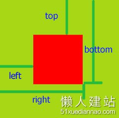
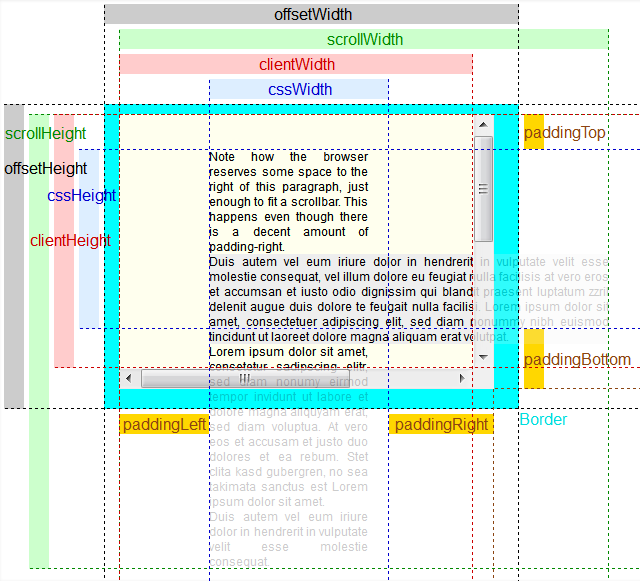
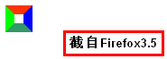

#html
[a标签设置点击事件如何设置href属性](#user-content-a标签设置点击事件如何设置href属性)

[关于tabindex和键盘事件](#user-content-关于tabindex和键盘事件)

[制作表头固定-左侧第一列固定-横向竖向可滚动](#user-content-制作表头固定-左侧第一列固定-横向竖向可滚动)

#js
[debounce的再次学习](#user-content-debounce的再次学习)

[关于正则正向肯定查找](#user-content-关于正则正向肯定查找)

[function构造函数的妙用](#user-content-function构造函数的妙用)

[关于正则的逻辑或](#user-content-关于正则的逻辑或)

[throttle](#user-content-throttle)

[关于js中的数字计算问题](#user-content-关于js中的数字计算问题)

[关于Number的toString方法](#user-content-关于number的tostring方法)

[关于textContent](#user-content-关于textcontent)

[关于bowlder中的defer](#user-content-关于bowlder中的defer)

[bowlder中load如果带at符号的处理](#user-content-bowlder中load如果带at符号的处理)

[正则exec和test使用全局标识匹配的问题](#user-content-正则exec和test使用全局标识匹配的问题)

[元素相对位置](#user-content-元素相对位置)

[关于图片加载完成的回调函数](#user-content-关于图片加载完成的回调函数)

[不能冒泡的js事件](#user-content-不能冒泡的js事件)

[动态加载html中含有style和script的处理](#user-content-动态加载html中含有style和script的处理)

[bowlder的数据绑定](#user-content-bowlder的数据绑定)

[mouseover和mouseenter区别](#user-content-mouseover和mouseenter区别)

[offsetWidth-clientWidth-scrollWidth](#user-content-offsetwidth-clientwidth-scrollwidth)

#node
[nodejshttp请求agent](#user-content-nodejshttp请求agent)

[node的读文件和pipe的内部原理](#user-content-node的读文件和pipe的内部原理)

# css
[等比例盒子](#user-content-等比例盒子)

[图片截取](#user-content-图片截取)

[css换行和超出部分隐藏](#user-content-css换行和超出部分隐藏)

[边框三角](#user-content-边框三角)

# http协议相关
[content-type](#user-content-content-type)

[关于http请求的请求体](#user-content-关于http请求的请求体)

[关于响应头Transfer-encoding](#user-content-关于响应头transfer-encoding)

# 其他
[chromedebug快捷键](#user-content-chromedebug快捷键)

[v8的设计架构](#user-content-v8的设计架构)

[NE的本地模拟环境流程](#user-content-ne的本地模拟环境流程)

[sublimtetext技巧](#user-content-sublimtetext技巧)

[javascript和java面向对象的区别](#user-content-javascript和java面向对象的区别)

#git
[git学习](#user-content-git学习)

[git技巧](#user-content-git技巧)

* * *

# a标签设置点击事件如何设置href属性
## 解释
  如果从想使用点击这个事件绑定到a标签这个事情来说的话,使用href="javascript:void(0),两个原因:

1.   如果使用#的话,必须在函数结尾加上return false或者preventDefault语法,
     防止默认的跳到页面开始位置.
2.   如果执行函数中抛出了错误,那么如果没有很好地错误处理的话,错误后面的
           代码就不会执行,那么就会跳到页面开始的位置.

  但是,更好的体验是:
  a标签的作用就是打开一个新的连接,所以如果你确实是想打开一个新的连接的话,
  直接使用href属性指向你的目标连接,而不要用onclick,
  因为onclick在使用滚轮点击和浏览器禁用javascript的情况下会无效.
  所以尽量不要在a标签中使用onclick,因为它还会导致侵入式的编程,并且不利于
  拓展和维护,因为在html中耦合了太多的代码.如果要要是用的话,直接写个button样式
  或者不给a标签增加href属性.

## 参考
[stackoverflow](http://stackoverflow.com/questions/134845/which-href-value-to-use-for-javascript-links-or-javascriptvoid0)

[非侵入式javascript](https://en.wikipedia.org/wiki/Unobtrusive_JavaScript)

[渐进增强](https://en.wikipedia.org/wiki/Progressive_enhancement)

# debounce的再次学习
  debounce用于防止短时间内重复执行函数太多次，目的是指定一个时间wait，
  让函数的真正执行至少在wait秒之后，期间如果连续触发函数，
  那么函数的真正执行在最后一次触发的wait秒之后。
  当第一次触发的时候，设置timeout到wait秒以后执行later函数。然后再触发的时候，只要timeout非空（没开始执行），只记录触发的时间，参数等,不再处理。
  later函数会判断现在时间减去最近一次触发debounce的时间，如果小于指定的延迟，那么再次延迟wait-last的时间执行。

# throttle
 触发函数后，每隔wait秒执行一次，如果中间多次触发，不响应。

# 关于tabindex和键盘事件
https://developer.mozilla.org/zh-CN/docs/Web/Accessibility/Keyboard-navigable_JavaScript_widgets

# 关于js中的数字计算问题
一定要注意，js的计算是有小数点的，没有整数，注意处理

# 关于正则正向肯定查找
    用于匹配zcs?=asd仅当zcs后面跟着asd才匹配

# function构造函数的妙用
    通过传参数可以把参数写入到函数体中，这样有些表达式可以不通过eval而是写成函数体。
    function genFunc(expr) {
        return new Function('obj', 'with(obj)return ' + expr);
    }
首先可以通过表达式的结果动态的创建函数，而且可以传参数。
## 构造函数和直接定义在作用域上的不同
  通过Function构造函数创建的函数,其作用域只有自己和全局两个,而不是像一般
  函数,作用域还包含了其定义的作用域.
## 参考
[MDN](https://developer.mozilla.org/en-US/docs/Web/JavaScript/Reference/Global_Objects/Function)

# 关于正则的逻辑或
    使用时候最好在需要或的地方加()，否则范围不定：
    /^abc|123$/ 对应实际是：
    
    /^ab(c|123)$/
    /^ab(c|12)3$/
    /^ab(c|1)23$/
    /^a(bc|1)23$/
    /^a(bc|12)3$/
    /^a(bc|123)$/
    /^(abc)|(1)23$/
    /^(abc)|(12)3$/
# content-type
 标识内容的mime-type
 请求头用来标识Post,put请求的formdata类型
 响应头用来标识返回内容的类型

# 关于http请求的请求体
[详见overstack回答](http://stackoverflow.com/questions/16339198/which-http-methods-require-a-body#answer-16339271)

关于crlf 等价于回车换行 \r\n

    一般来说，除了trace请求，
    head,1xx,204,304返回外，其他的都可以有请求体。
    
    an entity-body is explicitly forbidden in TRACE requests only, 
    all other request types are unrestricted 
    (section 9, and 9.8 specifically)
    
    a message-body is explicitly forbidden in responses to HEAD 
    requests (section 9, and 9.4 specifically)
    a message-body is explicitly forbidden in 1xx (informational), 
    204 (no content), and 304 (not modified) responses (section 4.3)

# 关于响应头Transfer-encoding
1. 常用于长连接，用来分片返回数据，告诉客户端什么时候传输结束。
2. 是pop-by-pop头
   [国内文章](https://imququ.com/post/transfer-encoding-header-in-http.html)
   [MDN](https://developer.mozilla.org/en-US/docs/Web/HTTP/Headers/Transfer-Encoding)

# 关于客户端如何判断响客户端发送结内容结束
1. 返回头content-length的值
2. 如果有Transfer-encoding头，值为chunked，忽略content-length
   的值，根据分片的长度判断，直到最后一片长度为0
3. 如果不是长连接，当服务端连接关闭时候。

详见[国内文章](https://imququ.com/post/transfer-encoding-header-in-http.html)

# 关于Number的toString方法
    Number.toString()是数字转换成字符串的方法，接受一个参数，用来表示转换的进制。默认是10。
    如果(35).toString(36) = z;

#关于textContent
node接口的一个属性,用于获取或设置这个dom的文本.
注意用法:
node.textContent = "";
当设置textContent值的时候,这个节点的所有childNodes都被移除,替换成一个包含字符串的文本节点,在jquery中用作

# 关于bowlder中的defer
[参见我的源代码阅读](%e6%ba%90%e4%bb%a3%e7%a0%81%e8%a7%a3%e8%af%bb%2fpromise%e8%a7%a3%e8%af%bb%e5%92%8c%e8%87%aa%e5%b7%b1%e7%9a%84%e7%ae%80%e5%8d%95%e5%ae%9e%e7%8e%b0.txt)

# bowlder中load如果带at符号的处理
  会把父亲组件的路径去掉文件,然后加上@后头路径

# 正则exec和test使用全局标识匹配的问题
同一个使用全局标识的正则连续匹配会出现不正确匹配:因为lastIndex每次匹配都会变化,设置为匹配的最终位置下次匹配从lastIndex位置开始

    var reg = /test/g;
    console.log(reg.test("这是1个test"));
    console.log(reg.lastIndex);
    console.log(reg.test("test不错啊啊啊"));

# chromedebug快捷键

    激活/解除断点效果: ctrl + F8
    下一个断点: F8
    跳到下一个调用栈: ctrl + ,
    返回上一个调用栈: ctrl + .
    在控制台中执行: Ctrl + Shift + E
    增加断点: ctrl + B
    debug多行: shift + enter

# canvas操作像素
    ImageData
    https://developer.mozilla.org/en-US/docs/Web/API/Canvas_API/Tutorial/Pixel_manipulation_with_canvas

#元素相对位置
## 视窗位置:浏览器可见位置,不包含滚动条.
## element.getBoundingClientRect 
    获取相对于视窗(就是浏览器左上角的位置),这个位置是动态计算的,包含这个元素内层的滚动,但是
    不包含整个浏览器的滚动条的位置,如果要计算相对于页面内容左上角的位置,需要加上
    window.pageYOffset和window.pageXOffset 
    https://developer.mozilla.org/en/docs/Web/API/Element/getBoundingClientRect

## offsetLeftandoffsetParent 
相对于offsetParent元素的偏移位置
offsetParent是一个指向最近的（closest，指包含层级上的最近）
包含该元素的定位元素。如果没有定位的元素，则 offsetParent 为最近的 table 元素对象或根元素（标准模式下为 html；quirks 模式下为 body）。
所以对于中间的元素来说,如果有滚动条的话,随着滚动,
元素的位置会上下,左右移动,因此还应该把所有父元素(除去body或window)的滚动条移动距离加上或减去.

    function getPos(e) {
        var left = 0,
            top = 0,
            scrollLeft = 0,
            scrollTop = 0,
            b = e.parentNode;
        while (e) {
          left = left + e.offsetLeft;
          top = top + e.offsetTop;
          e = e.offsetParent;
        }
        while (b && (b.nodeName.toLowerCase() !== "body")) {
          scrollLeft = scrollLeft + (b.scrollLeft||0);
          scrollTop = scrollTop + (b.scrollTop || 0);
          b = b.parentNode;
        }
        return {
          left: left - scrollLeft,
          top: top - scrollTop
        }
    }

# 关于图片加载完成的回调函数
 先看正确的例子:
 var img = new Image();
 img.onload = function() {
    img.onload = null;
    callback();
 }
 img.src = url;

几个点:
  1.回调函数中不要引用img,会造成低版本的IE无法回收内存(自己引用自己),
  所以执行的时候如果设置回调函数为null,
  一方面保证内存不会泄漏,
  第二方面防止GIF图重复触发onload事件
  2.为什么src要放到onload后头,因为如果有缓存的图片,
  刚设置src可能瞬间就要触发onload,这时候有的浏览器onload事件还没有设置,
  所以先设置onload
  3.不要使用complete属性
  4.无论是否有缓存,加载完成都会触发onload事件

# v8的设计架构
  https://github.com/v8/v8/wiki/Design%20Elements
  http://blog.pluskid.org/?p=186

js为什么慢?因为它是动态语言,每次访问一个对象的时候,都得动态的查找它的位置,
而像java或c,每一个对象的偏移位置都是确定的,
根据编译时候它们固定的类结构,因此一次查找就是一个取偏移值的过程,很快.
1.v8的目标就是内部实现隐藏的类,新建对象创建一个隐藏类,每个属性创建一个,
指定属性的偏移值.
2.v8的垃圾回收快:
  1.垃圾回收时候会暂停程序
  2.只暂停部分的内存空间
  3.每个对象都有指针

# 不能冒泡的js事件
    focus, blur, load, unload, change, reset, scroll, most of the DOM events (DOMFocusIn, DOMFocusOut, DOMNodeRemoved, etc), mouseenter, mouseleave, etc
submit在chrome中是可以冒泡的。不能冒泡的事件都可以capture（捕获）。 

# 动态加载html中含有style和script的处理
1. html中的`<style>`和`<link>`处理   
   把html中的`<style>和<link>`提取出来放到head中,等加载完成后,再把html append到页面上防止页面二次渲染(无样式闪烁)

  通过建个div,把innerHTML放到这个element中,然后取出`<style>`和`<link>`元素,
  创建标签，添加onload事件设置计数器,把这些元素放到head标签里,
  当这些link和style元素触发onload时候，
  通过类似promise的all的计数方法,判断是否都触发完毕，
  然后把innerHTML放到页面上.

2. html中的script标签

在有些浏览器中,直接innerHTML一个script是不能生效的,必须创建,append才行

    var a = createElement("script")
    a.src = "xx";
    document.body.appendChild(a);

# NE的本地模拟环境流程
后端三个环境:
1. 开发
2. 测试
3. 正式
   本地通过本地server转发请求到开发环境
   本地没问题push到测试环境进行测试
   没问题后放到正式环境
   部署流程:
   把放在后端svn上的代码通过Go系统做处理,合并,打包,替换ajax地址成本地文件后,
   放到前端svn地址,告诉后端,然后后端再从前端svn拉取代码,部署到线上.

4. 通过nodejs创建本地模拟后台,gooda
5. gooda可以配置不同域名和对应的目录位置,访问对应域名时候访问对应目录
6. 请求的html,css,js文件直接从本地目录读,返回
7. 如果html涉及到后端语言,就按照后端语言渲染了返回
8. 如果有ajax请求的话,后台会根据配置的路由进行选择,然后转发到真实的后台服务器
9. 给前端的后端地址都是一个IP，但是需要前端配置不同的hosts，
   后端会根据访问的hosts进行一个路由的转发。

# git学习
1.  和其他代码管理的区别
    1. cvs的问题:单点故障,影响所有客户端：服务器挂了,数据全丢了
    2. git是分布式的,每个节点保存所有的代码,服务器挂了,别的节点可以完全恢复。
    3. 分支管理特别简单
2.  git特点
    1. 保存的是每个版本文件的快照,而不是其他的差异列表
    2. 安全性高,每次修改,上传都做md5计算
3.  git配置
      中文文件名显示：

         #不对0x80以上的字符进行quote，解决git status/commit时中文文件名乱码
         git config --global core.quotepath false

# 制作表头固定-左侧第一列固定-横向竖向可滚动
 html结构是:
    

      <header style="overflow-x: hidden">
      </header>
      

        <firstColun style="position:absolute;left:scrollLeft">
      

    

  这样做出来,表头和内容实际是两个独立的滚动部分.然后让表头的横向滚动hidden,
  让内容垂直滚动.然后通过内容的滚动,触发scroll事件,让表头的scrollLeft和内容的scrollLeft同值,实现内容滚动,表头也滚动.然后再设置第一列的元素为绝对定位,横向滚动时候,让这些元素的left属性等于scrollLeft.

# git技巧
## gitignore
 文件 .gitignore 的格式规范如下：
[详见Gitbook回答](https://git-scm.com/book/zh/v2/Git-%E5%9F%BA%E7%A1%80-%E8%AE%B0%E5%BD%95%E6%AF%8F%E6%AC%A1%E6%9B%B4%E6%96%B0%E5%88%B0%E4%BB%93%E5%BA%93#忽略文件)

  1. 所有空行或者以 ＃ 开头的行都会被 Git 忽略。
  2. 可以使用标准的 glob 模式匹配。
  3. 匹配模式可以以（/）开头防止递归。
  4. 匹配模式可以以（/）结尾指定目录。
  5. 要忽略指定模式以外的文件或目录，可以在模式前加上惊叹号（!）取反。

如果要保存一个空目录的话，在目录下创建一个.gitkeep文件，然后
!tmp/.gitkeep

## 防止输入用户和密码
1. 给~/.gitconfig增加如下: 

    [credential]
        helper = store --file ~/.pwd
2. 编辑.pwd文件增加
      username=[]
      password=[]

### 我的gitconfig文件在同目录下

# 等比例盒子
核心方法就是利用padding-bottom的百分比是按照宽度的百分比来计算的，
这样设置宽度一定，高度为0，通过设置padding-bottom为宽度的对应比例。
    https://w3ctech.com/topic/1483

# 图片截取
1. 设置好父亲div的比例,按照比例,让image窄一点的边max-height100%,然后
   截取长的边(多出来的部分-长度)/2对应的margin,父亲divoverflow hidden
2. 设置背景图片,background-size: cover background-position: center

# bowlder的数据绑定
## 数据结构
 scope 
 widget 
 view 
 model
model是双向绑定
  通过向model的items里添加项目,形成数据<->视图的绑定.
  添加items时候,会绑定dom改变的事件函数,比如input元素对应change.
  改变dom会触发绑定事件的回调函数,触发model.update方法改变scope里的值

  改变scope值的时候(实际上是触发scope.refresh的时候)
  会遍历item里记录的items，每一个items找绑定的dom元素，获取dom的值，
  然后把这个值和scope里的值比较，如果不一样，就重新给node赋值。
view是单向绑定,只会当refresh时候,遍历views里的item,改变对应的dom

#sublimtetext技巧
0. [快捷键常用](sublime3快捷键.md)
1. 文件内搜索排除文件夹 

        -*/name_of_dir/*

# nodejshttp请求agent
目标是复用tcp链接,只有当设置了请求options的agent参数才可以

    new http.Agent({
      keepAlive: true,
      maxSockets: 1
    });
在node中,这个agent只有当sockets占满的情况下,才会对tcp池进行复用.
如果访问量小的话,maxSockets设置小一些,减少tcp创建,握手的时间,充分复用.
如果访问量大,maxSockets设置大一些,这样就不会因为访问量过大,导致少量的tcp链接被占用,然后等待tcp释放后再使用.
默认的maxSockets是无穷大，但实际上要根据操作系统的设置。

#node的读文件和pipe的内部原理
1. stream相关
   无论读或写流，都是通过内部函数_read或_write读或者写到一个缓冲区（buffer里），
   缓冲区的大小是highWaterMark参数控制。
   然后我们会从这个缓冲区里再读或者写到目标里。

2. pipe的实际作用
   我们从读缓冲区读出来，放到写缓冲区。
   如果写入速度慢，那么写缓冲区就会满，.write方法会返回false。
   然后我们就让读流暂停readstream.pause()，让写缓冲区释放。
   当写缓冲区释放到一定程度，会触发drain事件，
   在这个事件里再次让读流继续读radstream.resume()。达到控制的作用。
   pipe实际上帮我们平衡了读写，作用是减缓了内存的消耗，
   但是来回暂停的话实际是会拖慢速度的。

#http包头的格式
    HTTP1.1规定的HTTP包头格式如下
    请求方法 URI 协议/版本
    请求头：0或多行
    [\r\n\r\n] 两个CRLF(两个换行)
    正文部分
    --------------------
    协议/版本 状态码 状态描述
    响应头：0或多行
    \r\n
    正文部分

# css换行和超出部分隐藏
1. white-space 
   处理空白
2. word-wrap
   处理断句,不会在完整的词之间断句。
   如果一行放不下,首先会尝试放下一行看能不能放完整的,如果可以的话,
   就放到下一行.
3. word-break
   不考虑断句,直接有空白就断掉.
4. 超出字符串进行截取

      text-overflow: ellipsis;
      white-space: no-wrap;                
      overflow: hidden;

# mouseover和mouseenter区别
mouseover冒泡,在绑定元素内部的所有子元素的移动都会触发mouseover事件.
mouseenter不冒泡,绑定元素内部的移动不会触发该事件,只有进出绑定元素的时候
才会触发事件.

# offsetWidth-clientWidth-scrollWidth

1.  通过css或者style设置的width

     这个长度包含了滚动条的长度（如果有滚动条的话）

2.  cssWidth

       通过getComputedStyle获得的width属性，不包含滚动条的宽度和padding
       (在chrome下不包含滚动条长度)

3.  clientWidth

       包含padding的宽度，不包含滚动条宽度。

4.  offsetWidth：

       包括clientWidth + borderwidth + 滚动条宽度

5.  scrollWidth

       clientWidth + 滚动隐藏的内容长度

6.  算出滚动条宽度的方法有两种

       通用：
       e.offsetWidth - e.clientWidth - window.getComputedStyle(e).borderLeftWidth
    * window.getComputedStyle(e).borderRightWidth

    非chrome浏览器中计算出的width包含滚动条长度，所以：
    window.getComputedStyle(e).width + window.getComputedStyle(e).paddingLeft + window.getComputedStyle(e).paddingLeft - e.clientWidth

7.  注意事项

       clientWidth，offsetWidth 有可能因为浏览器缩放原因而不是整数，所以在计算的时候
       要注意小数js运算的问题
       另外getComputedStyle获取长款时候，获得的值有可能带PX，注意处理，通过
       parseInt(str, 10)能够直接截取后面非数字部分。

8.  判断一个元素是否有溢出或者隐藏的内容

       e.scrollWidth > e.clientWidth

# 边框三角
原理就是这张图

如果要实现不是实心的三角,使用另一个三角覆盖这个三角的一部分.

[参考](http://www.zhangxinxu.com/wordpress/2010/03/%E7%BA%AFcss%E5%AE%9E%E7%8E%B0%E5%90%84%E7%B1%BB%E6%B0%94%E7%90%83%E6%B3%A1%E6%B3%A1%E5%AF%B9%E8%AF%9D%E6%A1%86%E6%95%88%E6%9E%9C/)

# javascript和java面向对象的区别

javaascript的面向对象基于原型，而不是类

类继承：一个类就类似于一个蓝图-是对要创建对象的描述。
原型继承：一个原型就是一个工作对象实例。对象直接从对象获得继承。
传统的类继承有很多的缺陷，比如灵活性差，脆弱，最好使用对象组合而不是集成的方式，
而原型很适合对象组合。

原型继承的三种形式：
1. 连接继承

    直接复制对象属性到另一个对象，类似jquery的extend方法或es6的assign方法

2. 原型委托

    就是原型链继承，一直遍历prototype属性直到object.prototype，找到属性为止。

3.方法继承
    每个方法就是一个对象，如果这个方法不是构造函数的话，叫它工厂方法。通过工厂
方法直接生产出一个对象，给对象直接设置属性通过连接继承的方式。

作者的观念：
很多人认为js的继承就是原型链委托，但实际上原型链继承只不过是模拟java的类继承，而且还存在
类继承的问题，所以对js来说，最好的方式是使用对象组合。

## 原文地址
[类和原型继承的区别](https://medium.com/javascript-scene/master-the-javascript-interview-what-s-the-difference-between-class-prototypal-inheritance-e4cd0a7562e9#.wcbezftkc)

***
# node对比nextStick和setImmediate和setTimeout
nextStick在当前程序运行结束，进入到下个事件循环之前就执行，是最优先执行的，但是
这个类似于同步的操作，要注意造成阻塞，因为他会在任何事件循环里的io回调执行之前就进行操作。而且所有的nextStick方法都会一次性执行，比如在nextStick里一直nextStick方法的话，就会一直执行nextStick直到达到数量上限

setTimeout会在时间循环的时候检查timer，然后决定执行，如果只是为了延迟执行的话，
使用setImmediate，省去了检查时间的话费。

setImmediate会在下一个事件循环的末尾执行，每次事件循环只取出一个方法。
如果setImmediate和setTimeout都在一个io回调里出现，那么肯定是setImmediate先执行，因为setImmediate的循环在iocallback的后边。

>特别注意process.nextTick在Node.js v0.10后从事件循环中移除了。

[中文参考](https://cnodejs.org/topic/5556efce7cabb7b45ee6bcac)

[node官方参考](https://github.com/nodejs/node/blob/master/doc/topics/event-loop-timers-and-nexttick.md)

[node官方参考的翻译](http://www.codeba.cc/node-js-%E4%BA%8B%E4%BB%B6%E5%BE%AA%E7%8E%AF.html)

# 用户体验和网页响应速度
1. 每帧动画10ms产生一次。
2. 用户响应在100ms以内。
3. 载入或者视图切换在100-300ms以内是最好，其次可以接受的是300-1000ms。
4. 最大化空闲时间(用户没在交互，但主线程必须有空闲来迅速响应交互)
      1. 预加载尽量少，保证app迅速载入，剩下的预加载数据在空闲时加载
      2. 延迟的工作打包成50ms的块，每50ms把主程序控制权交换，保证100ms的响应原则。
5. 载入站点在1s以内。

# node命令行
1. `node --inspect`显示控制台
2. `node --expose-gc`可以在代码中调用`global.gc()`

# 内存检测
0. node有用的方法
   `process.memoryUsage().heapUsed`获取进程运行时占用内存
   `global.gc()` 手动触发垃圾回收操作

1. chrome任务管理器

   1. 打开方式 右侧竖着点点点->更多工具->任务管理器 或者Shift + Esc
   2. 列含义
      1. 最左侧的表示node内存
      2. 最右侧是js内存，括号里表示的是正在使用可获取的内存，如果这个值增大，说明新对象增加或现存对象变大。

# nodejs有关tcp，并发和requstAgent
### TCPKeepalive原理
[TCPKeepalive](http://tldp.org/HOWTO/TCP-Keepalive-HOWTO/overview.html)
## http_Agent
0. 如果不使用自己的agent的话，默认使用global.agent，三个值都是默认值，`keepalive=false, maxSockets=Infinity, maxFreeSockets = 256`因为maxSockets默认是无限大（实际上跟操作系统的参数一致），所以跟没有连接池差不多。
1. 如果确实不想用连接池的话，请设置`options.agent = flase`,禁止使用全局的连接池。
1. 发请求的http.agent的maxSocket指的是最多创建多少tcp连接，默认无限大。
2. keepalive选项开的话，实际调用的是socke.setKeepAlive。实际的作用就是激活操作系统的tcp协议的keepalive功能，在keepAliveMsecs时间之后会由系统发送keepalive嗅探包，具体的间隔根据操作系统定义。后续的操作都交给操作系统了。注意keepalive选项只是是否开启TCP keepalive功能，和连接池没关系，只要new了一个agent就会使用连接池。
3. 如果当前连接数目没超过maxSocket，
   而且有处于空闲状态的连接，就会复用空闲连接。
3. 每次发请求注意使用同一个agent，不能每次request的时候都new Agent，这样达不到
   复用tcp连接
4. 如果没有设置agent，默认使用global.agent，默认不开keepAlive
5. 注意maxFreeSockets选项，如果当前闲置连接数量大于maxFreeSockets，就会关闭多余空闲的连接。这时如果有新的请求过来，连接数没超过上限，又没有空闲的连接，就会再次创建一个新连接。
6. keepAliveMsecs:这个参数实际会作用于socket.setKeepAlive,并不是文档里写的每隔多少时间发送一个嗅探包判断对面是否还保持连接，而是tcp连接由空闲（最后收到数据的时间）开始计时，多少时间后第一次发嗅探包。相当于Linux参数TCP_KEEPIDLE。不过在最新版本的文档v7.7.1上已经改正了。[github上的讨论](https://github.com/nodejs/node/pull/10702)实际上这个值相当于Linux上tcp_keepalive_time。[keepalive国人总结](http://www.blogjava.net/yongboy/archive/2015/04/14/424413.html)

## http server检测tcp连接的方法和超时方法
      server.on("connection", function() {

      })
      当和服务器创建新的tcp连接时触发
    
        server.getConnections(function(err, num) {
            console.log("当前连接" + num);
        });
        获取当前TCP连接数
    
        server.setTimeout(xx);
        server.setTimeout(xx, function(socket) {
        });
        设置socket的超时时间，默认是120秒，如果没有自己设置回调函数的话，
        默认把超时的tcp连接关闭。如果自己自定义了回调，会执行自定义的回调，
        但是不关闭连接，需要自己处理。
## 关于tcp连接的关闭
浏览器和服务端都可以控制连接的关闭。
1. 浏览器
   chrome浏览器会自动发送fin包来关闭连接，很快，也就10秒左右。
   但是IE8就很慢。
2. node服务器
   通过server.setTimeout(xxxx)或者server.timeout控制,默认是2分钟。
   如果你使用server.setTimeout(xx毫秒，回调函数)传了回调函数，你就需要手动控制关闭socket（tcp）连接
   如果你没有传回调函数，默认会关闭超时的socket（tcp）连接。
3. httpClientRequest
   node的请求类，默认没有超时设置，也就是在返回之前单方面一直保持连接，
   通过req.setTimeout可以调用socket.setTimout设置超时，但这个超时只是触发响应函数，不做别的事情。
   问题1：
   因为socket会复用，所以request.setTimout是否会重置已经存在的socketTimeout
   答：
   每次设置request.setTimeout是会重新设置socket.setTimeout,但是如果这个socket还在等待接收的数据的话，是不会把这个socket分配给别的请求使用的，所以复用的情况下，必然已经是完成了一次传输的情况，从新设置timeout不会影响之前的超时的。
   计算超时的算法如下：
   如果是一个新socket，按照connect的时间开始计算，
   如果是一个旧的socket复用，按照request.on("socket")的时间开始计算，就是分配socket给请求的时间。
   问题2：socket.timeout(0)的含义

## socket hang up有可能出现错误的三种可情况
在客户端触发end或者close事件的时候，没有接收到返回的数据。
### 服务器端断开连接
### 客户端自己通过maxFreeSocket断开
情景：客户端请求一个长连接，服务器端设置很长的超时时间（一年），然后看客户端是否会主动断开。
结论：httpClientRequrest的socket超时也不会断开，不会自动断开tcp。

### 用户先请求一个server1，然后server1发送clientRequest到server2，server1先断开
  server1超时或其他原因和客户（浏览器）断开后，server1和server2的tcp连接并没有断开，必须由server1或server2断开才可以。

# bowlder的ne-repeat处理
节点前添加个空text节点nullnode，设置 
viewsItem：{
    node: [nullnode],
    attr: html(innerHTML),
    scope: scope,
    isJoin: isJoin,
    type: 'repeat',
    destroys: destroys
}
然后在执行refresh的时候，执行views.refresh,最终调用updateViews.repeat进行操作

# margin负值的使用
1. 参考资料
   [例子](http://www.cnblogs.com/jscode/archive/2012/08/28/2660078.html)
   [display不同情况的分析](http://www.cnblogs.com/xiaohuochai/p/5314289.html)

2. 都是block的时候，第二个元素margin-top:-5px时候，如果第二个元素有背景，那么背景会覆盖第一个元素的背景，但是不会覆盖第一个元素的边框和内容。

    　　HTML：

        <ul id="test">
            <li>Test</li>
            <li>Test</li>
            <li>Test</li>
            <li>Test</li>
            <li>Test</li>
        </ul>
    　　CSS：

        body,ul,li{margin:0;padding:0;}
        ul,li{list-style:none;}
        #test{
            margin:20px;
            width:390px;
            background:#F4F8FC;
            border-radius:3px;
            border:2px solid #D7E2EC;
        }
        #test li{
            height:25px;
            line-height:25px;
            padding:5px;
            border-bottom:1px dotted #D5D5D5;
            margin-bottom:-1px;
        }

这里头按说下面的元素会覆盖上面的元素，但是因为li没有设置背景色，所以背景不会覆盖上一个li的内容和border，而ul设置了背景，所以最后一个覆盖了。

# 弹性布局的几种方式
outline和border的区别，outline更好？
## 文章解析
[很好的文章](https://www.sitepoint.com/responsive-css-patterns-without-media-queries/?utm_source=frontendfocus&utm_medium=email)
这个文章涉及了
0. flex布局实现弹性布局
1. margin负值实现遮罩
2. calc配合min，maxwidth实现可变和可隐藏元素
3. padding是按照父元素的宽度计算百分比
4. 伪类after，before使用，
5. 通过添加伪类，动态设置伪类的padding[动态的calc(25em - 100%)]属性实现控制真正元素的大小。
6. 通过给图片添加伪类，设置background-image:linear-gradient,实现图片的渐变色效果。
7. 利用父元素定高度，overflow:hidden，子元素定宽度，flex-wrap:wrap的方式，实现隐藏菜单，但是子元素的高度是实际高度。然后根据这个实际高度利用四兄弟：max-height，height，calc实现根据菜单高度显示更多按钮。

使用`max-width,min-width,calc,width`实现大小可变的元素

1.   这里设置的阀值是25em，100%是根据父元素来计算，如果容器小于25em，那么是一个负值，那么根据min-width属性设置50%，如果容器大于25em，就会出一个很大的数，使用max-width属性设置100%
      {
        min-width: 50%;
        width: calc((25em - 100%) * 1000);
        max-width: 100%;
        /* Change 25em to your breakpoint. */
      }
2.   如果去掉min-width的设置，还会成为比25em小的话，width的值是0,再设置overflow:hidden。实现隐藏的效果，在低分辨率屏幕上隐藏不重要的内容，比如占位置的图片
3.   图片包含文字的说明
        

          
          ::after //负责处理图片，增加黑边
        

        
​
          :after 
          {
              padding-bottom: calc(25em - 100%) * 1000
              利用padding属性百分比是按照父元素宽度来计算的知识点，来判断图片宽度是否超过阀值。
              如果包裹元素的宽度很大，那么这个值是负的，
              那么这个的包裹元素的padding为0，然后父元素的高度是0.那么根据margin-bottom
              为-10，那么下边的区块会从图片下边倒数10em的地方覆盖。
              如果包裹的元素宽度很小，那么这个值是正的，会非常大，因为没有限制maxPadding的属性，就设置父元素的max-height是10em，那么父元素最高就是10em。那么高10em，padding-bottom10em，那么下面的文字区块就是从图片下方开始排列。就是让小图片的文字别档上图片。
          }

        

        

          真正的文字区块
        

4.   弹性布局配合calc,height,max-x,min-x实现自动显示more选项卡。

      菜单的父元素设置成固定高度，overflow：hidden;
      菜单设置成弹性布局，自动换行，最后一个元素显示更多设置成绝对定位，然后
      height: (2em - 100%) * -1000,
      max-height: 设置成菜单高度
      如果包裹元素很窄，那么由于弹性布局的自动换行，菜单的高度就是不是原来的高度了，然后根据计算，显示更多的height就变成菜单高度。

# 关于css的包含块概念
包含块和定位以及百分比有关系。
定位的top,left等值是根据包含块参考的。
[包含块网址](http://www.w3help.org/zh-cn/kb/008/)

[百分比参照物](http://acgtofe.com/posts/2014/06/percentage-in-css)

当一个元素的高度使用百分比值，如果其包含块没有明确的高度定义（也就是说，取决于内容高度），且这个元素不是绝对定位，则该百分比值等同于auto。

# tcpkeepalive
[我的译文](tcp翻译.md)
[国人的总结写的不错](http://www.blogjava.net/yongboy/archive/2015/04/14/424413.html)
几个关键点：
1. Linux系统的三个参数
    

       # cat /proc/sys/net/ipv4/tcp_keepalive_time
       7200
       # cat /proc/sys/net/ipv4/tcp_keepalive_intvl
       75
       # cat /proc/sys/net/ipv4/tcp_keepalive_probes
       9

分别代表空闲多少秒发送嗅探包，嗅探包发送间隔和嗅探包重试次数。

2. 一般自定义程序就是覆盖这三个参数
3. 有可能引发的错误
    1. ETIMEOUT 超时错误，在发送一个探测保护包经过(tcp_keepalive_time + tcp_keepalive_intvl * tcp_keepalive_probes)时间后仍然没有接收到ACK确认情况下触发的异常，套接字被关闭
    java.io.IOException: Connection timed out
    2. EHOSTUNREACH host unreachable(主机不可达)错误，这个应该是ICMP汇报给上层应用的。
     java.io.IOException: No route to host
    3. 链接被重置，终端可能崩溃死机重启之后，接收到来自服务器的报文，然物是人非，前朝往事，只能报以无奈重置宣告之。
    java.io.IOException: Connection reset by peer

  
