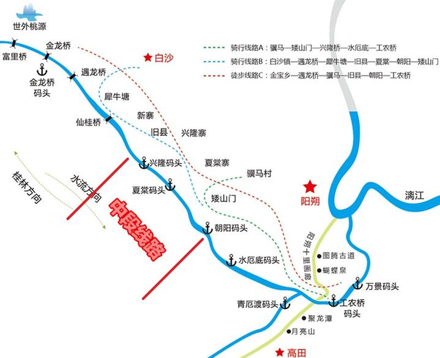
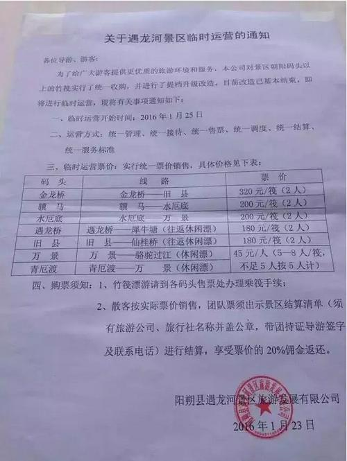

# 桂林到阳朔
1. 去杨堤码头
    1. 在桂林汽车客运总站(桂林市象山区中山南路65号（距火车桂林站约600米）)坐车到杨堤码头直达
  
        `桂林-杨堤	中级席座	19元	桂林 - 杨堤码头	7:20 8:20 10:30 11:30 13:30`

    2. 在桂林火车站广场搭乘“桂林至阳朔的班车”（为慢车，每10分钟/班），在杨堤路口下车（不到杨堤码头），时程约1-1.5小时，车费约15元，再在路口换乘从阳朔至杨堤码头的小巴，车费约3元/人，约15分钟即到

    [交通参考](http://www.mafengwo.cn/poi/21837.html)

2. 乘竹筏漂流到兴坪或九马画山（兴坪是全程价格216元，九马画山是全程的2/3价格118元)
3. 如果漂流到九马画山，那么顺着漓江顺流往下走，步行到兴坪码头（或者直接做电瓶车到兴坪码头）;如果是漂流到兴坪，直接下来就是兴坪码头。 然后往东走，逛一下古镇
4. 然后在阳朔兴坪汽车站坐车坐车到阳朔，入住

# 阳朔游玩
1. 十里画廊骑行

    阳朔-大榕树-月亮山-月亮山村-鉴山寺-燕村-田家河-阳朔

2. 遇龙河骑行+漂流
    1. 逆着遇龙河骑行到金龙桥 12公里1小时 
    2. 在金龙桥码头漂流到旧县，自行车可以让公司的人送到下游去。

3. 晚上西街，刘三姐（可选）

 
 

[遇龙河漂流参考](http://www.lvmama.com/trip/show/278845) 
[阳朔骑行参考](http://www.mafengwo.cn/gonglve/ziyouxing/1622.html) 

`tips：早一点去漂，人会很少，可以更好的感受遇龙河宁静的样子。总时间3个多小时。`